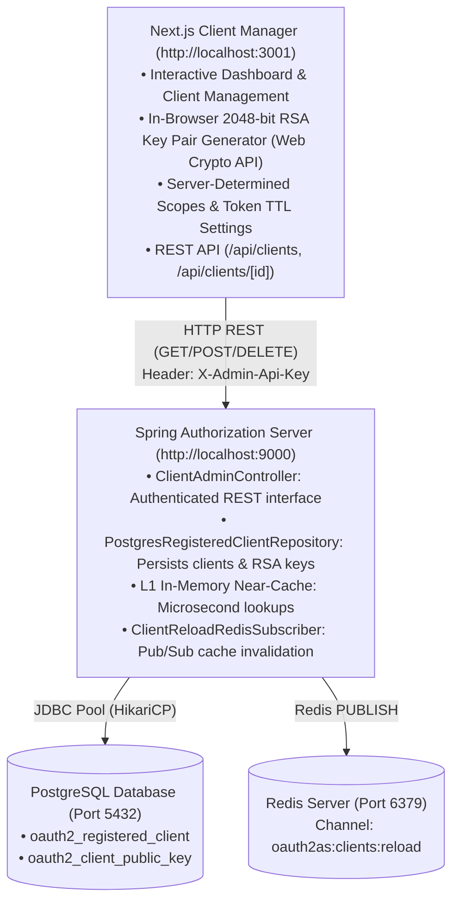

# OAuth 2.1 Client Configuration Manager (Next.js 16 & Spring Admin API)

A modern, responsive administrative web application and REST API for managing registered OAuth 2.1 client configurations via Spring Authorization Server's secure administrative interface, persisted in **PostgreSQL** with instantaneous cluster near-cache synchronization.

> [!TIP]
> **Client Developer Onboarding:** For full instructions on generating client keys, registering client details, and integrating a Rails client application, refer to the [New Client Onboarding & Integration Guide](../docs/guides/new_client_onboarding_guide.md).

---

## Architecture Overview



---

## Features

1. **Organizational Architecture Compliance**:
   - Next.js never connects directly to PostgreSQL. All operations flow through Spring Auth Server's authenticated `/api/admin/clients` endpoint.
   - Zero AWS S3 dependencies, zero S3 IAM policies, and zero relational database drivers in the frontend.

2. **In-Browser Cryptographic Key Pair Generation**:
   - Generate secure 2048-bit RSA key pairs (`RS256`) directly in the browser via the native Web Crypto API.
   - Automatically populates the public key in X.509 PEM format into the configuration form.
   - Provides a one-click download for the corresponding private key (`<client_id>_private_key.pem`) for use by the client application.

3. **Server-Determined Scopes Configuration**:
   - Toggle standard server-determined scopes (`openid`, `profile`, `email`, `user.read`, `demo.secret_access`) or define custom scopes.
   - Guarantees clients cannot self-assign privileged scopes.

4. **Real-Time Cluster Invalidation**:
   - When a client is created, updated, or deleted, Spring updates PostgreSQL, purges its local L1 near-cache, and broadcasts an invalidation notice across the cluster via Redis Pub/Sub (`oauth2as:clients:reload`).

---

## REST API Endpoints

### 1. `GET /api/clients`

Retrieves all registered clients via Spring Admin API (`/api/admin/clients`).

### 2. `POST /api/clients`

Creates or updates a client in PostgreSQL via Spring Admin API.

- **Request Body**: JSON client configuration matching the `ClientConfig` schema.
- **Response**: HTTP 201 with saved client data.

### 3. `DELETE /api/clients/[id]`

Deletes the client configuration from PostgreSQL via Spring Admin API.

- **Response**: HTTP 200 `{"success": true, "clientId": "<id>"}`.

---

## Running Locally

### Prerequisites

- Node.js 20+ (LTS) and `pnpm`
- Spring Auth Server running:
  - **Direct local mode (outside Docker)**: `http://localhost:9000`
  - **Docker Compose cluster mode**: Connect to internal bastion `http://localhost:9001` (since Nginx on port `9000` intentionally blocks external `/api/admin/*` access).

### Environment Configuration

Create or update `.env.local`:

```bash
PORT=3001
# In Docker cluster mode, target internal Spring bastion on port 9001:
SPRING_AUTH_SERVER_URL=http://localhost:9001
ADMIN_API_KEY=secret-admin-key
```

### Start Development Server

```bash
pnpm install
pnpm dev -p 3001
```

### Production Build & Run

```bash
pnpm build
pnpm start -p 3001
```

Visit: **`http://localhost:3001`**

---

## Testing & Code Quality

### Unit Tests & Coverage (100% Enforced)
Run Vitest with React Testing Library and v8 coverage:
```bash
pnpm test
```

### Static Analysis & Formatting
Run Oxlint and Oxfmt:
```bash
pnpm lint
pnpm format:check
pnpm format        # Auto-formats TypeScript and TSX files
```

### End-to-End Tests
Client management and OAuth flows are validated end-to-end via Cucumber:
```bash
cd ../e2e-tests
mise exec -- bundle exec cucumber
```
