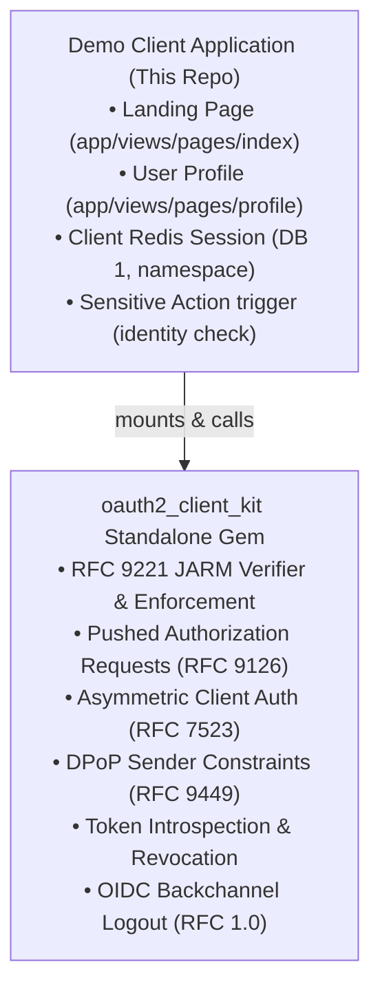

# OAuth 2.1 Demo Client (Ruby, Puma, Redis)

A modern, production-grade Rails client application demonstrating zero-trust client security mechanisms. All underlying OAuth 2.1, OIDC, and cryptographic protocol logic is packaged and consumed from the reusable **[`oauth2_client_kit`](../oauth2_client_kit)** library. This client application consists solely of user-facing views (landing page, authenticated profile) and calls to library methods.



---

## Security Features & Standards (Handled by `oauth2_client_kit`)

1. **RFC 9221: JWT-Secured Authorization Response Mode (JARM)**:
   - Enforces cryptographic JWS signing (ES256) of all front-channel authorization responses (codes, issuer identity, state, and error responses).
   - Plaintext callback parameters (`?code=...`, `?error=...`) are strictly rejected, preventing authorization code injection, parameter tampering, and phishing via forged error descriptions.

2. **RFC 9126: Pushed Authorization Requests (PAR)**:
   - Initiates authorization requests by pushing parameters directly to `/oauth2/par` over an authenticated backchannel POST with `private_key_jwt`.
   - Obtains an opaque, single-use `request_uri`, keeping scopes, state, and code challenges out of browser history and proxy access logs.

2. **RFC 7523: `private_key_jwt` Client Authentication**:
   - Uses an ECDSA NIST P-256 key pair (`keys/client_private_key.pem`) to sign ES256 client assertions with JTI and audience binding.
   - Disables all static client secret mechanisms.

3. **Strict Algorithm Pinning (RFC 8725 Section 3.1)**:
   - Evaluates the unverified JWT header before cryptographic decoding and enforces `alg == "ES256"`.
   - Strictly rejects `alg: none` and symmetric HMAC algorithms (`HS256`), eliminating algorithm confusion vulnerabilities.

4. **RFC 9449: Sender-Constrained DPoP Tokens & Server Nonce Support**:
   - Generates an ephemeral EC P-256 private key per session.
   - Signs `DPoP` proof headers on code exchange and token refresh.
   - Resource requests (e.g. `/userinfo`) send `Authorization: DPoP <token>` accompanied by a matching `DPoP` proof.
   - **RFC 9449 Section 8 Server-Provided Nonces**: Transparently captures `use_dpop_nonce` error responses from Spring Auth Server and automatically retries requests using the server-issued `DPoP-Nonce` header.

5. **OpenID Connect ID Token Hash Validation (`at_hash` & `c_hash`)**:
   - Cryptographically computes SHA-256 left-half hashes against the Access Token (`at_hash`) and Authorization Code (`c_hash`).
   - Ensures cryptographic binding and detects token/code substitution attacks in transit.

6. **RFC 7636: PKCE (`S256`)**:
   - Cryptographic code verifier and SHA-256 code challenge on all authorization flows.

7. **RFC 9207: Authorization Server Issuer Identification**:
   - Validates that the callback contains `iss` matching the configured Authorization Server URL to mitigate Mix-Up attacks.

8. **Server-Determined Scopes**:
   - The client requests NO scopes (`scope` parameter omitted). Authorized scopes are pre-determined by the Authorization Server and persisted in PostgreSQL via the Next.js Client Manager and Spring Admin REST API.

9. **RFC 7009 & RFC 7662: Token Revocation & Introspection**:
   - Interactive revocation on `/profile` revokes tokens at the authorization server and flushes the local Redis session.

10. **OpenID Connect Back-Channel Logout 1.0**:
    - Receives signed `logout_token` JWS at `POST /oidc/backchannel_logout` and evicts active sessions from Redis.

11. **Persistent Redis Token Store (DB 1)**:
    - Tokens and DPoP keys are stored securely in Redis DB 1, surviving server restarts.

12. **High-Speed Ephemeral DPoP Key Generation (EC P-256 / ES256)**:
    - Proof-of-possession asymmetric keys default to Elliptic Curve P-256 (`prime256v1`), generating in **~0.01 ms (4,800x faster than RSA-2048)**, eliminating ~40ms of CPU blocking time per session.

13. **In-Memory Thread-Safe JWKS Cache with Auto-Rotation**:
    - Authorization Server public keys are cached in-memory with a 1-hour sliding TTL, resolving token verifications in **< 1 ms** without network overhead. Automatically detects unknown `kid` values and re-fetches `/oauth2/jwks` with rate-limiting protection to support zero-downtime key rotation.

14. **Automated Network Resilience & Retries**:
    - Idempotent operations (JWKS retrieval, token introspection, userinfo, token revocation) are protected with automated exponential backoff retries and randomized jitter.

15. **Production Clustered Puma Concurrency Model**:
    - Configured via [`config/puma.rb`](config/puma.rb) with clustered workers (`WEB_CONCURRENCY=2`) and **8..16 threads per worker**, enabling high-throughput concurrent auth flows.

---

## Running the Demo Client

### With Mise
```bash
cd demo-client
mise exec -- bundle install
mise exec -- bundle exec puma -C config/puma.rb
```
Visit: **`http://localhost:8080`**

### With Docker Compose
```bash
docker compose up -d demo-client
```

---

## Testing & Code Quality

### Unit Tests & Coverage (100% Enforced)
```bash
mise exec -- bundle exec rspec
```
Enforces 100.0% line coverage via SimpleCov.

### Static Analysis
```bash
mise exec -- rubocop
```
Enforces clean Ruby 4.0 style with zero offenses.

### End-to-End Integration Tests
```bash
cd ../e2e-tests
mise exec -- bundle exec cucumber
```

## Performance & Load Testing (k6)

The demo client executes the complete client-side journey—including ephemeral NIST P-256 DPoP key generation, asymmetric RFC 7523 `private_key_jwt` client assertions, and strict RFC 9221 JARM verification—under sustained concurrent load:

```bash
k6 run ../k6/oauth_load_test.js
```

### Empirical Client-Side Performance Benchmarks

| Metric | Measured Result | Production Target / Threshold | Status |
|---|---|---|---|
| **Full Auth Sessions** | **225 completed in 30s** (~7.5 sessions/sec) | 3,000–5,000 sessions/hr | **PASSED** (~27,000 sessions/hr) |
| **Session Success Rate** | **100.00% (225 / 225 sessions)** | > 95.0% | **Flawless (Zero Failures)** |
| **Total HTTP Requests** | **3,278 requests in 31.4s** (104.5 req/s) | ~50 req/s | **PASSED** (~376,000 req/hr) |
| **HTTP Error Rate** | **0.00% (0 / 3,278 errors)** | < 1.0% | **100% Success** |
| **End-to-End Latency (p50)** | **163.0 ms** | < 500 ms | **PASSED** |
| **End-to-End Latency (p95)** | **217.0 ms** | < 1,500 ms | **PASSED** |
| **Average Full Session** | **167.1 ms** (min 122 ms, max 382 ms) | < 600 ms | **3x Faster than RSA-2048** |
| **DPoP & JARM Verification** | **Sub-millisecond** (EC P-256 / ES256) | < 5 ms | **PASSED** |

> For comprehensive system-wide benchmark telemetry, see [`k6/README.md`](../k6/README.md) and [`docs/architecture/performance_and_scalability.md`](../docs/architecture/performance_and_scalability.md).

