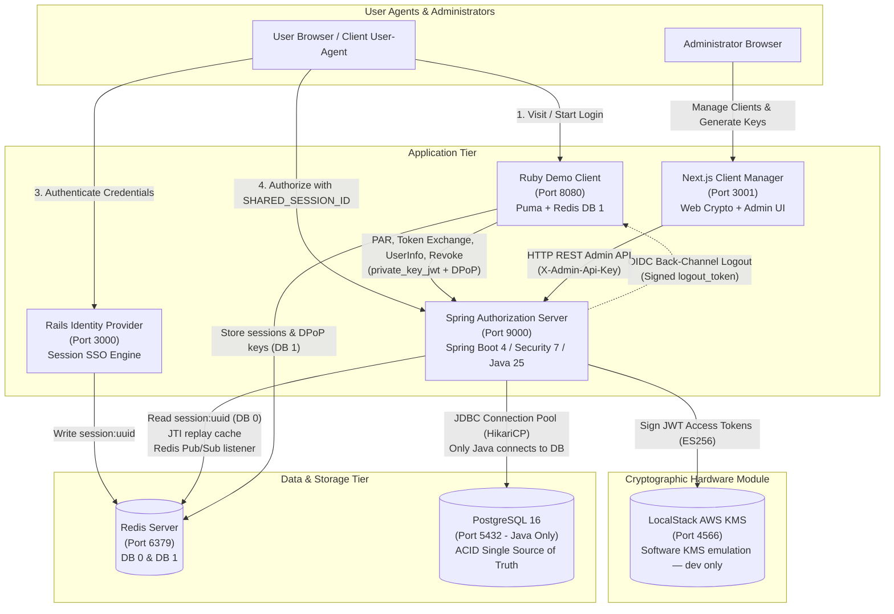

# Architecture & Communication Flows

This directory contains technical architectural diagrams and end-to-end communication sequence flows for the OAuth 2.1 & OpenID Connect platform.

---

## Component Topology & Infrastructure

---

## Detailed Sequence Flow Guides

Click the links below to inspect specific end-to-end communication flows:

1. [**OAuth 2.1 Authorization Code Flow with PAR, DPoP & Rails SSO**](oauth2_par_dpop_flow.md)
   - Step-by-step breakdown of RFC 9126 PAR backchannel submission, RFC 7523 client assertion verification, Rails IdP SSO session creation, RFC 9221 JARM response signing (AWS KMS ES256), RFC 9207 issuer identification, and RFC 9449 sender-constrained DPoP token minting.

2. [**Client Configuration, Persistence & Near-Caching Flow**](client_config_and_caching_flow.md)
   - Deep dive into the **PostgreSQL Persistence $\rightarrow$ L1 JVM Near-Cache $\rightarrow$ Redis Pub/Sub Cluster Invalidation** hierarchy, demonstrating sub-millisecond lookups and secure HTTP Admin API integration without direct DB exposure.

3. [**Token Lifecycle, Revocation & OIDC Back-Channel Logout Flow**](token_lifecycle_and_logout_flow.md)
   - Detailed diagrams for RFC 7009 Token Revocation, RFC 7662 Token Introspection, and OpenID Connect Back-Channel Logout 1.0 signed JWT dispatch.

4. [**PostgreSQL Persistence, High-Performance Near-Caching & Architecture Specification**](postgres_persistence_and_performance.md)
   - Architectural deep-dive on PostgreSQL durability, AWS S3 decommissioning rationale, HikariCP configuration, Flyway schema migrations, and zero-loss horizontal scaling.

5. [**Performance, Scalability & Bottleneck Analysis**](performance_and_scalability.md)
   - Concurrency bottleneck identification, benchmark metrics (EC vs RSA DPoP, in-memory JWKS, multi-session pool), resilience/retry patterns, and high-scale roadmap.

6. [**AWS KMS Key Management, Multi-Key JWKS Rotation & Algorithm Pinning**](kms_multi_key_rotation_flow.md)
   - Hardware Security Module (HSM) boundary **(FIPS 140-2 / FIPS 140-3 Level 3 when deployed against real AWS KMS; LocalStack is a software emulation locally)**, zero-downtime multi-key JWKS rotation lifecycle, automated rotation tooling, and strict RFC 8725 algorithm pinning.

7. [**Network Perimeter & Reverse Proxy Routing Architecture**](network_perimeter_and_proxy_routing.md)
   - External reverse proxy / ALB path routing specification isolating internal administrative APIs (`/api/admin/**`) from public OAuth 2.1 traffic, with configuration templates for AWS ALB, Nginx, Kubernetes Ingress, and Cloudflare WAF.

8. [**Interface Contracts & Unified Data Dictionary**](contracts_and_data_dictionary.md)
   - Formal JSON schema specification for the Rails $\leftrightarrow$ Spring Redis SSO session, unified Redis key taxonomy and TTL lifecycle matrix, and PostgreSQL DDL/ERD schema reference.

9. [**User Management, Authentication & Fraud Revocation**](user_management_and_authentication.md)
   - The `app_users` store, the `/api/admin/users` administrative API, the two-stage SHA-256 → BCrypt password pipeline, the Rails IdP `/authenticate` integration, and the fraud-flag → global session revocation flow.

10. [**Higher Key & Cryptographic Standards**](higher_key_and_crypto_standards.md)
    - Rationale for the completed ES256 (ECDSA NIST P-256) migration, FIPS 140-3 posture and 5-step production roadmap, and future hardening options (Argon2id/PBKDF2, mTLS).

11. [**JWT-Secured Authorization Requests (JAR, RFC 9101) — Design Option**](jar_rfc9101_design_option.md)
    - Evaluation of JAR signed request objects vs the implemented RFC 9126 PAR flow, why it is documented rather than implemented, a recommended PAR + JAR shape, and pros/cons.

12. [**Component Interactions, Data Flows & State Storage Specification**](component_interactions_and_data_flows.md)
    - Component-by-component architectural perspective detailing what data enters each component, for what person/identity, why and where it is stored (Redis DB 0 & 1, PostgreSQL, KMS, cookies), its lifecycle and TTL, who reads it, and what outbound calls each component makes.

13. [**Spring Security 7 & Authorization Server: Usage, Divergences & Architectural Innovations**](spring_security_usage_and_divergences.md)
    - Comprehensive technical audit of Spring Security 7 features utilized, deliberate divergences from standard practices (external Rails IdP, Redis JSON session, server-determined scopes, strict `private_key_jwt`), improvements upon defaults (AWS KMS HSM signing, DER-to-P1363 transcoding, DPoP nonces, JARM, graceful logout), and custom implementations.

---

## Developer & Tester Guides

- [**Developer Cookbook & Iteration Guide**](../guides/developer_cookbook.md): Dual-mode execution (Docker vs. local IDE debugging), Admin API `curl` client registration examples, custom JWT claim recipes, and hot-cache reload commands.
- [**Testing & Troubleshooting Guide**](../guides/testing_and_troubleshooting.md): Test fixture & credential matrix, automated test execution, failure diagnostic workflows, and boilerplate for writing new functional test scenarios.

---

## Port & Protocol Reference

| Service | Port | Protocol / Path | Purpose |
|---|---|---|---|
| **`nginx`** | `9000` | HTTP / TCP | Edge perimeter reverse proxy (exposes public OAuth/OIDC, blocks /api/admin) |
| **`spring-auth-server`**| `9001` (internal) | HTTP / TCP | RFC-hardened OAuth 2.1 & OIDC Authorization Server backend (internal container :9000) |
| **`demo-client`** | `8080` | HTTP / TCP | End-user interactive OAuth 2.1 client application |
| **`rails-app`** | `3000` | HTTP / TCP | External login & Identity Provider (sets `SHARED_SESSION_ID`) |
| **`client-manager`** | `3001` | HTTP / TCP | Administrative UI for client configuration (connects directly to Spring :9000) |
| **`postgres`** | `5432` | PostgreSQL / TCP | ACID persistence for registered clients & runtime authorization records |
| **`localstack`** | `4566` | HTTP / KMS API | Emulated AWS KMS — **software emulation, no HSM/FIPS** (real AWS KMS provides the FIPS 140-2 Level 3 HSM in production) |
| **`redis`** | `6379` | RESP / TCP | DB 0 (SSO, JTI), DB 1 (Client Tokens), and Pub/Sub cluster invalidation |

