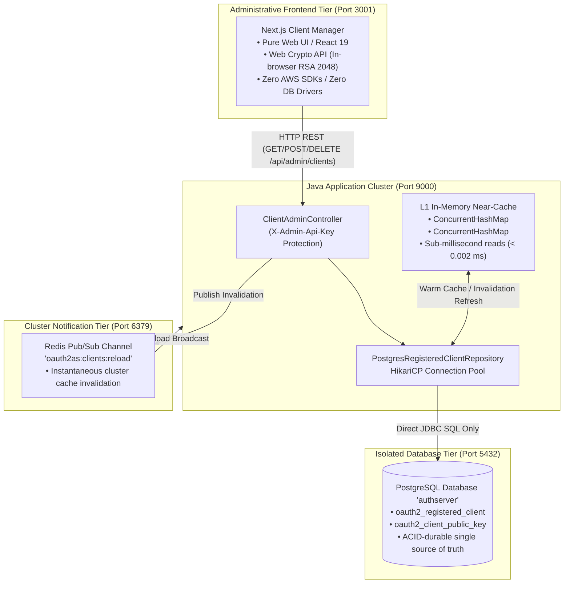
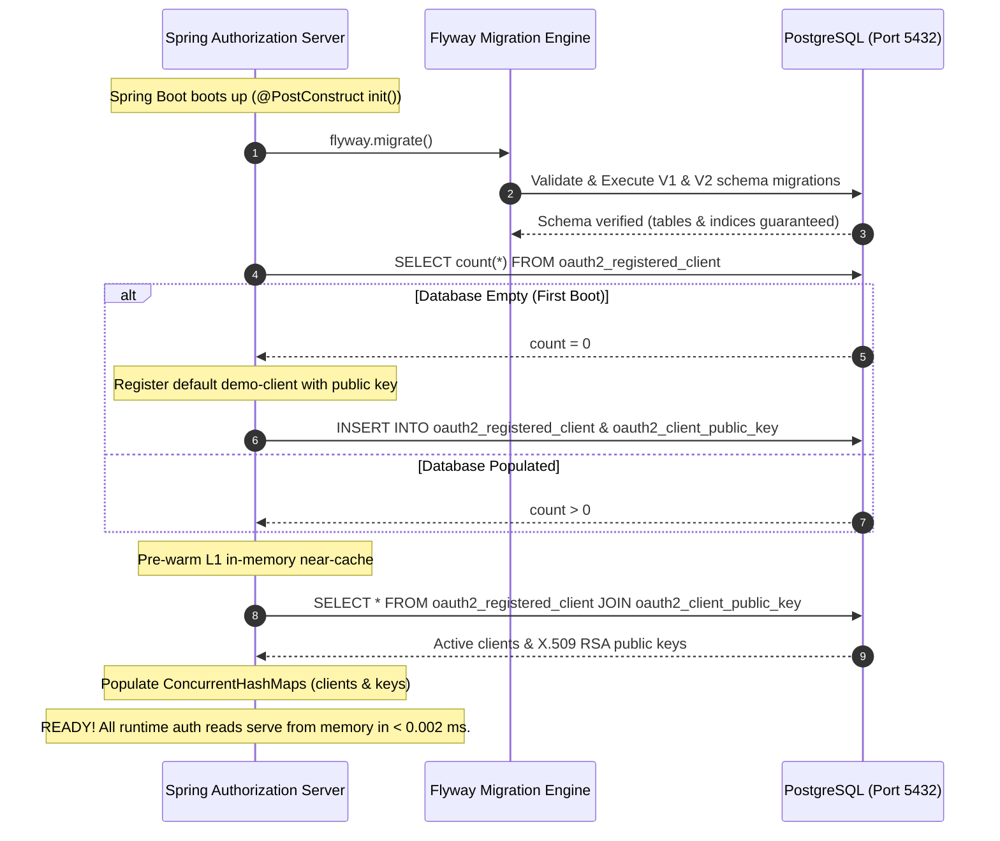
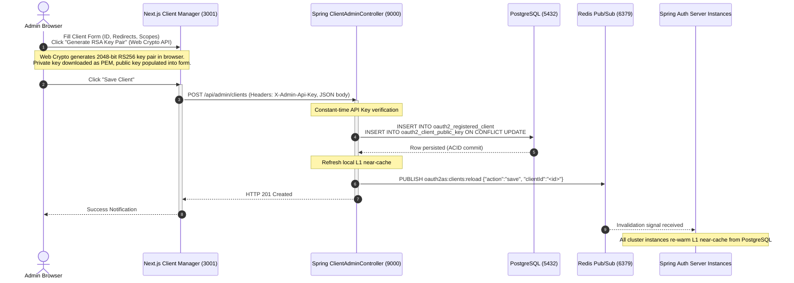
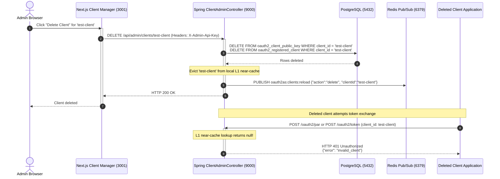

# Client Configuration, Persistence & Near-Caching Flow

This document details the configuration management, PostgreSQL relational persistence, and high-performance near-caching architecture for registered OAuth 2.1 clients across **Next.js**, **PostgreSQL**, **Redis Pub/Sub**, and **Spring Authorization Server**.

> [!NOTE]
> **Implementation Status: Fully Implemented & Production-Active**
> AWS S3 has been completely deprecated and purged from this flow. Registered client configurations and RSA public keys are persisted with ACID durability in PostgreSQL, accessible only through the Java Spring Admin REST API (`/api/admin/clients`). Runtime authorization reads resolve in ~0.001 ms from the in-memory L1 near-cache with zero database round-trips.

---

## Architecture Topology & Trust Boundaries

To comply strictly with the organizational policy that **only the Java application communicates directly with PostgreSQL**, external administrative clients (such as Next.js) never receive database credentials. Instead, they interact with Spring Auth Server via an authenticated REST interface (`/api/admin/clients`).

---

## Flow 1: Service Startup & Near-Cache Pre-Warming

---

## Flow 2: Dynamic Client Creation via Admin REST API

---

## Flow 3: Dynamic Client Deletion & Immediate Revocation

