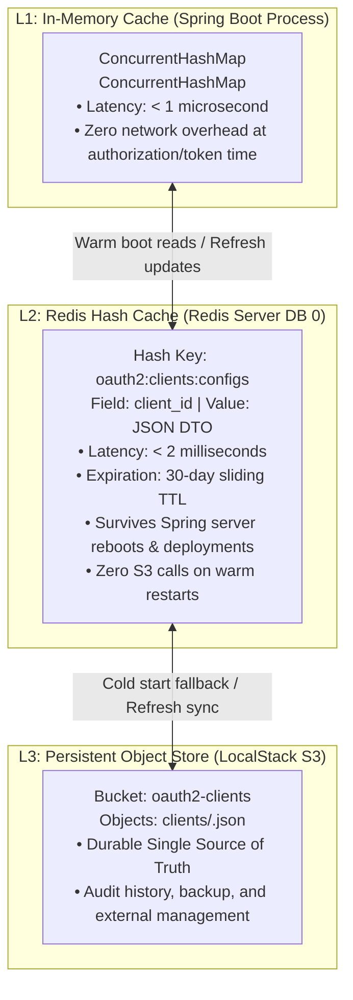
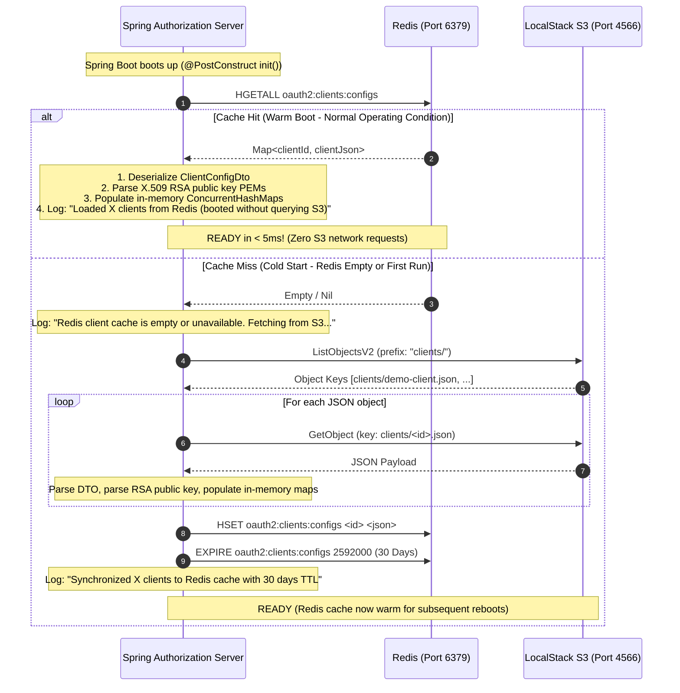
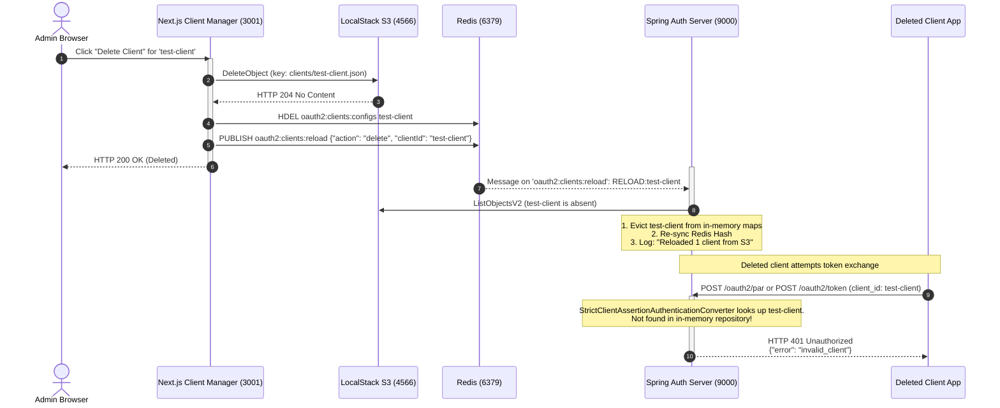

# Multi-Tier Client Configuration & Hot-Reload Flow

This document details the configuration management and multi-tiered caching architecture for registered OAuth 2.1 clients across **Next.js**, **LocalStack S3**, **Redis**, and **Spring Authorization Server**.

---

## Multi-Tier Cache Hierarchy



---

## Flow 1: Service Startup (Warm Boot vs. Cold Start)



---

## Flow 2: Dynamic Client Creation & Real-Time Hot-Reload

```mermaid
sequenceDiagram
    autonumber
    actor Admin as Admin Browser
    participant Manager as Next.js Client Manager (3001)
    participant S3 as LocalStack S3 (4566)
    participant Redis as Redis (6379)
    participant Spring as Spring Auth Server (9000)

    Admin->>Manager: Fill Client Form (ID, Redirects, Scopes)<br/>Click "Generate RSA Key Pair" (Web Crypto API)
    Note over Admin, Manager: Web Crypto generates 2048-bit RS256 key pair in browser.<br/>Private key downloaded as PEM; public key populated into form.
    Admin->>Manager: Click "Save Client Configuration"
    activate Manager

    %% 1. Write S3
    Manager->>S3: PutObject (bucket: oauth2-clients, key: clients/<id>.json)
    S3-->>Manager: HTTP 200 OK

    %% 2. Sync Redis Hash
    Manager->>Redis: HSET oauth2:clients:configs <id> <json>
    Manager->>Redis: EXPIRE oauth2:clients:configs 2592000 (30 Days)

    %% 3. Publish Reload Event
    Manager->>Redis: PUBLISH oauth2:clients:reload {"action": "save", "clientId": "<id>"}
    Manager-->>Admin: HTTP 201 Created (Client saved)
    deactivate Manager

    %% 4. Spring Reload Trigger
    activate Spring
    Redis-->>Spring: Message on 'oauth2:clients:reload': RELOAD:<id>
    Note over Spring: ClientReloadRedisSubscriber receives event.<br/>Triggers asynchronous refresh() in < 15ms.
    Spring->>S3: ListObjectsV2 & GetObject
    S3-->>Spring: Fresh JSONs
    Note over Spring: 1. Update in-memory ConcurrentHashMaps<br/>2. Re-sync Redis Hash with renewed 30-day TTL<br/>3. Log: "Reloaded X clients from S3"
    deactivate Spring

    Note over Admin, Spring: New client can immediately authenticate with private_key_jwt without server restart!
```

---

## Flow 3: Dynamic Client Deletion & Immediate Revocation


