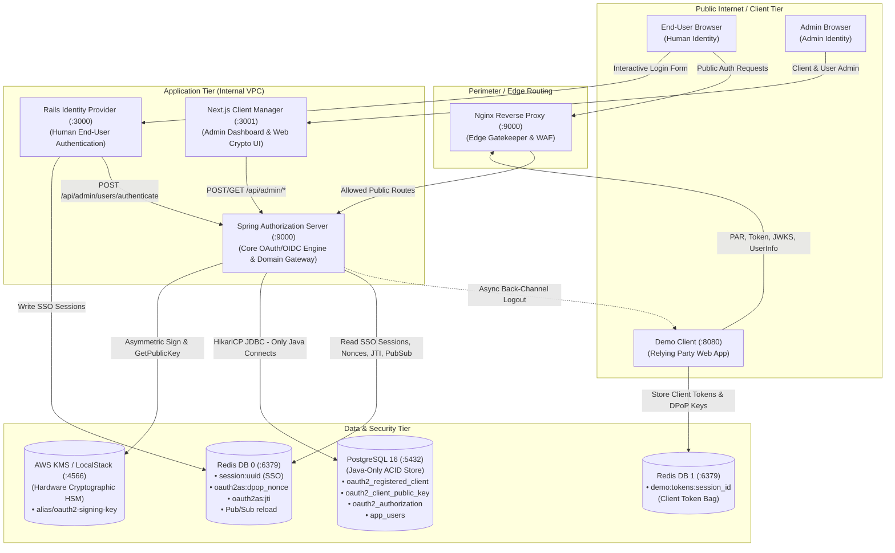
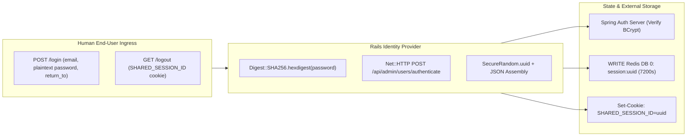
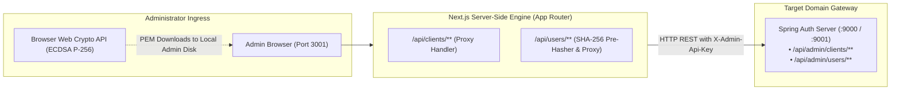
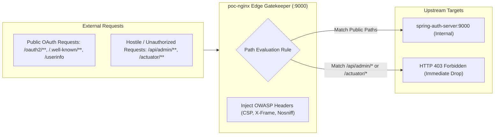

# Component Interactions, Data Flows & State Storage Specification

This document details the OAuth 2.1 & OpenID Connect platform **from the perspective of each individual component**. While protocol sequence diagrams show the chronological flow across systems, this specification documents each component as an independent processing node:
- What triggers and inbound data it receives (and for what person/identity).
- What state it reads from and writes to storage (Redis, PostgreSQL, KMS, Cookies, In-Memory).
- Why that data is stored, its lifecycle/TTL, and who downstream consumes it.
- What outbound calls and security boundaries each component enforces.

---

## Component Ecosystem Architecture

---

## 1. Spring Authorization Server (`spring-auth-server`)

The central policy decision point (PDP), token issuer, and protected domain gateway for the entire ecosystem.

```mermaid
flowchart LR
    subgraph Ingress ["Inbound Data & Triggers"]
        ReqAuth["GET /oauth2/authorize (User Cookie + PAR request_uri)"]
        ReqPAR["POST /oauth2/par (Client private_key_jwt + params)"]
        ReqToken["POST /oauth2/token (Client private_key_jwt + code + DPoP)"]
        ReqIntrospect["POST /oauth2/introspect (Client private_key_jwt + token)"]
        ReqRevoke["POST /oauth2/revoke (Client private_key_jwt + token)"]
        ReqUserInfo["GET /userinfo (DPoP sender-constrained token)"]
        ReqAdmin["/api/admin/** (X-Admin-Api-Key)"]
        SubReload["Redis SUB: oauth2as:clients:reload"]
    end

    subgraph SpringEngine ["Spring Authorization Server"]
        Filters["Security Filters (SharedSession, DPoP, AdminAuth)"]
        NearCache["L1 Near-Cache (ConcurrentHashMap)"]
        TokenGen["KmsJwtEncoder & Token Minter"]
    end

    subgraph StorageOps ["Storage & External Interactions"]
        R0_Read["READ Redis DB 0 (session:uuid, jti, dpop_nonce)"]
        R0_Write["WRITE Redis DB 0 (jti replay, dpop_nonce, DEL session)"]
        PG_Ops["READ/WRITE PostgreSQL (HikariCP)"]
        KMS_Ops["RPC AWS KMS (GetPublicKey, Sign)"]
    end

    Ingress --> SpringEngine
    SpringEngine <--> StorageOps
```

### Inbound Data & Actors
| Endpoint / Trigger | Caller / Identity | Data Carried In | Processing Purpose |
|---|---|---|---|
| `POST /oauth2/par` | Client App (`demo-client`) | Client assertion JWT (`private_key_jwt`), redirect URI, scope, PKCE `code_challenge`, state | Validates client signature against pre-warmed EC public key, assigns opaque `request_uri`. |
| `GET /oauth2/authorize` | Human End-User (Browser) | `SHARED_SESSION_ID` cookie, `request_uri` | Evaluates user SSO session; if absent, redirects to Rails IdP. If present, issues JARM-signed authorization code. |
| `POST /oauth2/token` | Client App (`demo-client`) | Authorization `code`, `code_verifier`, `private_key_jwt`, `DPoP` proof header | Verifies PKCE, client assertion, and DPoP thumbprint. Mints sender-constrained Access Token, Refresh Token, and ID Token. |
| `GET /userinfo` | Client App on behalf of User | `Authorization: DPoP <access_token>`, `DPoP` proof header | Verifies DPoP binding matches token `cnf.jkt`. Returns user profile claims (`sub`, `email`, `name`). |
| `POST /oauth2/introspect` | Resource Server / Client | `token`, `token_type_hint`, `private_key_jwt` | Returns active status, scopes, expiration, and DPoP thumbprint (`cnf.jkt`). |
| `POST /oauth2/revoke` | Client App | `token`, `token_type_hint`, `private_key_jwt` | Marks token as revoked in PostgreSQL. |
| `/api/admin/clients/**` | Next.js Client Manager | Client settings, scopes, redirect URIs, EC public key PEM, `X-Admin-Api-Key` | Validates and persists client to PostgreSQL; updates L1 near-cache; broadcasts Redis reload event. |
| `/api/admin/users/**` | Rails IdP / Next.js Manager | User credentials, SHA-256 pre-hashed password, fraud flag, `X-Admin-Api-Key` | Authenticates via BCrypt, flags fraud, triggers global session revocation. |
| Redis Pub/Sub channel `oauth2as:clients:reload` | Peer Spring Nodes / Admin API | JSON payload: `{"action": "save"|"delete"|"reload", "clientId": "..."}` | Triggers local L1 near-cache reload from PostgreSQL. |

### Data Read & Written by Spring Auth Server
| Data Store | Key / Table | Operation | Data Schema / Structure | Why Stored & How Used | TTL / Lifecycle | Consumer / Downstream |
|---|---|---|---|---|---|---|
| **Redis DB 0** | `session:<uuid>` | **READ** | JSON: `{ username, email, name, roles, authenticated_at }` | Hydrates Spring `SecurityContext` for human user during `/oauth2/authorize`. | Managed by Rails (7,200s) | Spring Auth Server |
| **Redis DB 0** | `session:<uuid>` | **DELETE** | Key eviction | Invoked when user is flagged as fraud or logs out to invalidate active browser sessions. | Immediate | Human User (forced re-login) |
| **Redis DB 0** | `oauth2as:jti:<uuid>` | **READ & WRITE** | String: `"1"` | RFC 7523 client assertion replay defense. Rejects duplicate assertion IDs within the 5-minute validity window. | 300s (5 min) | Spring Auth Server |
| **Redis DB 0** | `oauth2as:dpop_nonce:<nonce>` | **READ, WRITE & DEL** | String: `"1"` | RFC 9449 Section 8 server-provided DPoP nonces. Defeats replay and clock-skew attacks. Generated on initial request, consumed on use. | 60s | Spring Auth Server |
| **Redis DB 0** | Channel: `oauth2as:clients:reload` | **PUBLISH & SUBSCRIBE** | JSON: `{"action":"save", "clientId":"..."}` | Cluster cache synchronization. Forces all cluster nodes to refresh local in-memory clients within milliseconds. | Ephemeral (Pub/Sub) | All Spring Auth Server instances |
| **PostgreSQL** | `oauth2_registered_client` | **READ & WRITE** | Columns: `id`, `client_id`, `client_authentication_methods`, `scopes`, `redirect_uris`, `client_settings`, etc. | Canonical durable store for client applications. Loaded into L1 near-cache on boot/reload. | Permanent | Spring Auth Server |
| **PostgreSQL** | `oauth2_client_public_key` | **READ & WRITE** | Columns: `client_id`, `public_key_pem` (X.509 EC P-256 PEM) | Cryptographic verification of client assertions (`private_key_jwt`). Loaded into L1 cache. | Permanent | Spring Auth Server |
| **PostgreSQL** | `oauth2_authorization` | **READ, WRITE & DELETE** | Columns: `authorization_code_value`, `access_token_value`, `refresh_token_value`, `state`, expiry timestamps | Persists active grants, tokens, and revocation status across pods and restarts. Expired rows purged nightly. | Retained 30 days post-expiry | Spring Auth Server |
| **PostgreSQL** | `app_users` | **READ, WRITE & UPDATE** | Columns: `id` (UUID), `email`, `password_hash` (BCrypt), `is_fraud` (bool) | Human end-user accounts and fraud status. | Permanent | Spring Auth Server |
| **AWS KMS** | `alias/oauth2-signing-key` | **RPC CALL** | SHA-256 Digest $\rightarrow$ 64-byte IEEE P1363 Signature | Asymmetric token signing inside HSM boundary. Private key never leaves KMS. | Managed in KMS | Spring Auth Server |
| **JVM Heap** | `ConcurrentHashMap` | **IN-MEMORY CACHE** | Pre-warmed `RegisteredClient` and `ECPublicKey` objects | Serves runtime client lookups in ~0.001 ms with zero database queries. | Process lifetime | Spring Auth Server |

---

## 2. Rails Identity Provider (`rails-app`)

The human-facing authentication authority responsible for credential collection, fraud handling, and single sign-on (SSO) session creation.

### Inbound Data & Actors
| Endpoint / Trigger | Caller / Identity | Data Carried In | Processing Purpose |
|---|---|---|---|
| `GET /login?return_to=...` | Human End-User Browser | `return_to` parameter (sanitized against whitelist) | Renders the branded authentication form. Sanitizes return target to prevent open redirect vulnerabilities. |
| `POST /login` | Human End-User Browser | `email`, `password` (plaintext in form body), `return_to`, CSRF token | Computes `SHA-256(password)`, authenticates via Spring Admin API, creates Redis SSO session. |
| `GET /logout` | Human End-User Browser | `SHARED_SESSION_ID` cookie | Deletes session from Redis DB 0, clears browser cookie, redirects to login. |
| `GET /health` | Load Balancer / Monitoring | None | Responds with HTTP 200 `{"status": "UP"}`. |

### Data Read & Written by Rails IdP
| Data Store | Key / Target | Operation | Data Schema / Structure | Why Stored & How Used | TTL / Lifecycle | Consumer / Downstream |
|---|---|---|---|---|---|---|
| **Spring Auth Server API** | `POST /api/admin/users/authenticate` | **OUTBOUND HTTP** | JSON: `{ "email": email, "password": sha256_hex }`, Header: `X-Admin-Api-Key` | Delegates credential verification to Spring's BCrypt engine. Plaintext password never crosses network. | Per-request | Spring Auth Server |
| **Redis DB 0** | `session:<uuid>` | **WRITE** | JSON: `{ "username": user_id, "email": email, "name": display_name, "roles": ["ROLE_USER"], "authenticated_at": ISO8601 }` | Stores the active human user SSO identity. Provides single sign-on across the entire domain. | 7,200s (2 hours) | Spring Auth Server |
| **Redis DB 0** | `session:<old_session_id>` | **DELETE** | Key eviction | Mitigates Session Fixation attacks by destroying the user's prior session before minting a new one. | Immediate | Redis DB 0 |
| **User Browser** | Cookie: `SHARED_SESSION_ID` | **SET-COOKIE** | UUIDv4 string (`^[0-9a-fA-F-]{36}$`), `HttpOnly; SameSite=Lax; Path=/` | Carries user session reference to Spring Authorization Server via browser redirect. Never exposed in URLs. | 7,200s | Browser / Spring AS |

---

## 3. Next.js Client & User Manager (`client-manager`)

The dedicated administrative portal for managing OAuth client applications, issuing client credentials via in-browser Web Crypto, and administering platform user accounts.

### Inbound Data & Actors
| Route / Action | Caller / Identity | Data Carried In | Processing Purpose |
|---|---|---|---|
| Browser "Generate EC Key Pair" | Administrator (Client-side) | None (invokes native Web Crypto API in browser) | Generates in-browser ECDSA NIST P-256 key pair. Downloads private key PEM to disk; sets public key in form. |
| `POST /api/clients` | Administrator via Web UI | Client ID, client name, scopes, redirect URIs, EC public key PEM | Passes client definition to Spring Auth Server Admin API with `X-Admin-Api-Key`. |
| `DELETE /api/clients/[id]` | Administrator via Web UI | Client ID | Forwards deletion request to Spring Auth Server Admin API. |
| `POST /api/users` | Administrator via Web UI | `email`, `password` | Pre-hashes password with `crypto.createHash('sha256')`, forwards to Spring Admin API. |
| `POST /api/users/[email]/fraud` | Administrator via Web UI | User email | Calls Spring Admin API to flag user as fraud and trigger immediate session revocation. |

### Data Read & Written by Next.js Client Manager
| Target | Mechanism | Operation | Data Transferred | Why Stored / Transferred | Persistence / Isolation |
|---|---|---|---|---|---|
| **Admin Local Disk** | In-Browser Download | **FILE SAVE** | `<client_id>_private_key.pem` (PKCS#8 PEM) | Private key for the client application to sign `private_key_jwt` assertions. | Stored ONLY on developer machine; never touches Next.js server or network. |
| **Spring Admin API** | Outbound HTTP REST | **POST /api/admin/clients** | JSON client metadata + EC public key PEM | Enrolls client into PostgreSQL and warms L1 JVM near-cache. | Persisted in PostgreSQL by Spring Boot. |
| **Spring Admin API** | Outbound HTTP REST | **POST /api/admin/users** | JSON: `{ email, password: sha256_hex }` | Creates user in `app_users` table with BCrypt hash. | Persisted in PostgreSQL by Spring Boot. |
| **Direct DB / Redis** | **NONE (Zero Access)** | **ISOLATED** | **Zero direct connections** | Next.js contains NO database drivers, NO Redis clients, and NO AWS SDKs, strictly enforcing data tier isolation. | Pure HTTP domain client. |

---

## 4. OAuth 2.1 Client Library (`oauth2_client_kit`) & Demo Client (`demo-client`)

The relying party implementation demonstrating end-to-end integration with the Authorization Server using Ruby on Rails, the `oauth2_client_kit` engine, and Redis token storage.

```mermaid
flowchart LR
    subgraph ClientIngress ["Relying Party Ingress"]
        UserNav["Browser: GET /login, GET /profile, POST /logout"]
        JARMCallback["Browser: GET /callback?response=<jarmJwt>"]
        BackChannel["Spring AS: POST /oidc/backchannel_logout (logout_token)"]
    end

    subgraph ClientEngine ["OAuth2ClientKit & Demo Client Engine"]
        PARCaller["push_authorization_request (ES256 DPoP + private_key_jwt)"]
        TokenCaller["exchange_code_for_token (DPoP + Nonce Retry)"]
        JWKSCache["In-Memory JWKS Cache (1-hr TTL, Auto-Refresh)"]
        JARMVerifier["JARM & ID Token Signature Verifier (ES256)"]
    end

    subgraph ClientState ["Client Storage & State"]
        RedisDB1["WRITE/READ Redis DB 1: demo:tokens:session_id"]
        ClientCookie["Set-Cookie: _demo_client_session"]
    end

    ClientIngress --> ClientEngine
    ClientEngine <--> ClientState
```

### Inbound Data & Actors
| Endpoint / Action | Caller / Identity | Data Carried In | Processing Purpose |
|---|---|---|---|
| `GET /login` | Human End-User Browser | User clicks "Login" | Generates ephemeral EC P-256 DPoP key, submits PAR request, redirects browser to Spring AS with `request_uri`. |
| `GET /callback` | Human End-User Browser | JARM response JWT (`?response=<jwt>`) | Verifies JARM signature against AS JWKS, extracts `code`, exchanges code for DPoP sender-constrained tokens. |
| `GET /profile` | Human End-User Browser | Client session cookie (`_demo_client_session`) | Loads tokens from Redis DB 1, signs DPoP proof, calls `/userinfo`, renders dashboard. |
| `POST /oidc/backchannel_logout` | Spring Auth Server (Webhook) | Signed `logout_token` JWS | Verifies token signature, extracts `sub`/`sid`, evicts user's token session from Redis DB 1. |

### Data Read & Written by Demo Client
| Data Store | Key / Target | Operation | Data Schema / Structure | Why Stored & How Used | TTL / Lifecycle | Consumer / Downstream |
|---|---|---|---|---|---|---|
| **Redis DB 1** | `demo:tokens:<session_id>` | **WRITE & READ** | JSON: `{ access_token, refresh_token, id_token, dpop_private_key_pem, user_claims, expires_at }` | Retains client application tokens and the ephemeral DPoP private key bound to the access token. | 86,400s (24 hours) | Demo Client |
| **Redis DB 1** | `demo:tokens:<session_id>` | **DELETE** | Key eviction | Clears tokens on local user logout or on receiving an OIDC Back-Channel Logout signal from Spring AS. | Immediate | Demo Client |
| **In-Memory Cache** | `@jwks_cache` | **CACHE** | Array of parsed public JWK keys from `/oauth2/jwks` | Verifies JARM response, ID token, and logout token signatures without network round-trips. | 3,600s (1 hr TTL) + dynamic cache-bust on unknown `kid` | Demo Client |
| **User Browser** | Cookie: `_demo_client_session` | **SET-COOKIE** | Encrypted/signed Rails session ID | Links the browser user agent to the token bag stored in Redis DB 1. | Session / 24 hrs | Demo Client |

---

## 5. Perimeter Reverse Proxy (`poc-nginx`)

The zero-trust edge gatekeeper enforcing perimeter routing, blocking administrative surfaces, and setting uniform OWASP response headers.

### Inbound Data & Routing Rules
| Incoming Path | External Classification | Edge Proxy Action | Downstream Destination | Header Modifications |
|---|---|---|---|---|
| `/oauth2/**` | Public OAuth 2.1 | **ALLOW** | Forward to `spring-auth-server:9000` | Injects `X-Real-IP`, `X-Forwarded-For`, `X-Forwarded-Proto`. |
| `/.well-known/**` | Public Discovery | **ALLOW** | Forward to `spring-auth-server:9000` | Proxied with standard edge caching rules. |
| `/userinfo` | Public Resource | **ALLOW** | Forward to `spring-auth-server:9000` | Preserves `Authorization: DPoP` and `DPoP` headers. |
| `/connect/logout` | Public Logout | **ALLOW** | Forward to `spring-auth-server:9000` | Preserves query parameters and cookies. |
| `/api/admin/**` | **Internal Administrative** | **BLOCK (HTTP 403)** | **Terminated at edge** | Never reaches JVM heap or Tomcat connection pool. |
| `/actuator/**` | **Internal Telemetry** | **BLOCK (HTTP 403)** | **Terminated at edge** | Never reaches JVM heap. |

---

## 6. Comprehensive Cross-Component State & Storage Matrix

A unified reference table summarizing **every piece of data stored across the entire ecosystem**:

| Storage Layer | Key / Location | Owning Producer | Downstream Readers | Data Contents | For What Person / Entity | Purpose & Justification | Retention / TTL |
|---|---|---|---|---|---|---|---|
| **Redis DB 0** | `session:<uuid>` | Rails IdP (`SessionsController`) | Spring Auth Server (`SharedRedisSessionFilter`) | JSON `{ username, email, name, roles, authenticated_at }` | Human End-User (e.g. `alice_smith@example.com`) | Decouples authentication from authorization; provides seamless Single Sign-On without sharing DB. | 7,200s (2 hrs sliding) |
| **Redis DB 0** | `oauth2as:dpop_nonce:<nonce>` | Spring Auth Server (`DPoPNonceFilter`) | Spring Auth Server (`DPoPNonceFilter`) | String `"1"` | Relying Party Client per request | RFC 9449 server-supplied nonces defeating token request replay and clock-skew proof attacks. | 60 seconds (single-use) |
| **Redis DB 0** | `oauth2as:jti:<jti_uuid>` | Spring Auth Server (`ClientAssertionDecoder`) | Spring Auth Server (`ClientAssertionDecoder`) | String `"1"` | Relying Party Client (e.g. `demo-client`) | RFC 7523 client assertion replay prevention. Rejects duplicate assertion IDs. | 300 seconds (5 mins) |
| **Redis DB 0** | Channel `oauth2as:clients:reload` | Spring Admin API (`ClientAdminController`) | All running Spring Auth Server nodes | JSON `{"action": "save"|"delete", "clientId": "..."}` | System / Cluster Infrastructure | Instantaneous hot-cache invalidation across all nodes without server restarts. | Ephemeral (Pub/Sub) |
| **Redis DB 1** | `demo:tokens:<session_id>` | Demo Client (`AuthController`) | Demo Client (`PagesController`, UserInfo service) | JSON `{ access_token, refresh_token, id_token, dpop_private_key_pem, user_claims }` | Human End-User session at relying party | Durable token bag storage allowing relying party to access user profile and refresh access tokens. | 86,400s (24 hrs) |
| **PostgreSQL** | `oauth2_registered_client` | Spring Admin API (`ClientAdminController`) | Spring Auth Server (`PostgresRegisteredClientRepository`) | Relational columns: `id`, `client_id`, `scopes`, `redirect_uris`, `client_settings` | Registered Application (e.g. `demo-client`) | ACID durable single source of truth for client application metadata and authorized scope grants. | Permanent |
| **PostgreSQL** | `oauth2_client_public_key` | Spring Admin API (`ClientAdminController`) | Spring Auth Server (`PostgresRegisteredClientRepository`) | Relational columns: `client_id`, `public_key_pem` (EC P-256) | Registered Application (e.g. `demo-client`) | Cryptographic public key used to verify client assertions (`private_key_jwt`). | Permanent |
| **PostgreSQL** | `oauth2_authorization` | Spring Auth Server (`JdbcOAuth2AuthorizationService`) | Spring Auth Server (`JdbcOAuth2AuthorizationService`) | Relational columns: `authorization_code`, `access_token`, `refresh_token`, metadata | Authenticated User + Client binding | Maintains runtime authorization state, issued tokens, and revocation status across pods and restarts. | Retained 30 days post-expiry |
| **PostgreSQL** | `app_users` | Spring Admin API (`UserAdminController`) | Rails IdP via Spring `/authenticate` endpoint | Relational columns: `id`, `email`, `password_hash` (BCrypt), `is_fraud` | Human End-User (e.g. `alice_smith@example.com`) | Canonical human identity store; records credentials and administrative fraud flags. | Permanent |
| **AWS KMS** | `alias/oauth2-signing-key` | DevOps / CI-CD Operator | Spring Auth Server (`KmsJwtEncoder`, `KmsEcSigner`) | Asymmetric Key Pair (`ECC_NIST_P256`), KeyUsage: `SIGN_VERIFY` | Authorization Server System Identity | Hardware cryptographic boundary (FIPS 140-2 / 140-3 Level 3). Private key is non-exportable. | Rotated gracefully with 24h overlap |
| **Browser Cookie** | `SHARED_SESSION_ID` | Rails IdP (`SessionsController`) | Spring Auth Server (`SharedRedisSessionFilter`) | UUIDv4 string (`^[0-9a-fA-F-]{36}$`), `HttpOnly`, `SameSite=Lax` | Human End-User | Secure session bearer passing authentication state across domains/ports without URL parameter leakage. | 7,200 seconds |
| **Browser Cookie** | `_demo_client_session` | Demo Client (`demo-client`) | Demo Client (`demo-client`) | Encrypted/signed Rails session ID | Human End-User at Demo Client | Binds browser session to the client token bag in Redis DB 1. | 24 hours |
