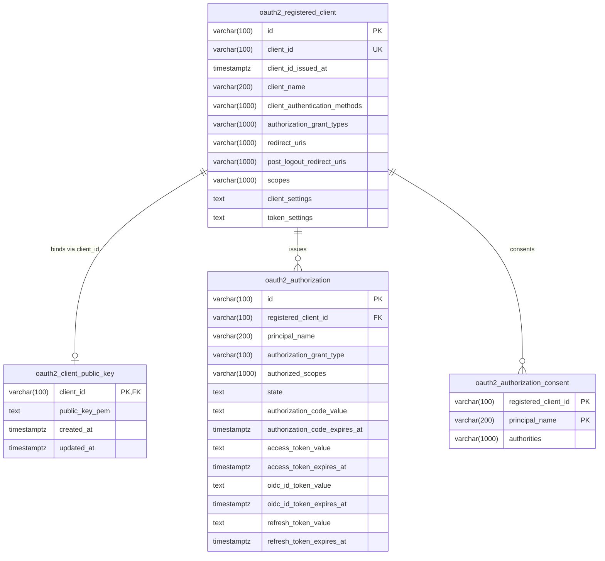

# Interface Contracts & Unified Data Dictionary

This document defines the formal data structures, interface contracts, Redis namespaces, and database schemas that govern communication and state across the OAuth 2.1 & OpenID Connect platform.

---

## 1. The Shared Redis SSO Session Contract (Rails IdP $\leftrightarrow$ Spring Auth Server)

The platform decouples identity verification (handled by the Rails IdP) from authorization grant issuance (handled by Spring Authorization Server) via a shared, high-speed Redis session store.

```mermaid
sequenceDiagram
    autonumber
    participant Browser as User Browser
    participant Spring as Spring Auth Server (:9000)
    participant Rails as Rails Login IdP (:3000)
    participant Redis as Redis DB 0 (:6379)

    Browser->>Spring: GET /oauth2/authorize?client_id=...
    Note over Spring: SharedRedisSessionFilter checks SHARED_SESSION_ID cookie
    Spring-->>Browser: Redirect 302 -> http://localhost:3000/login?return_to=...
    Browser->>Rails: GET /login & POST /login (Credentials)
    Note over Rails: Authenticates user, generates UUIDv4 session_id
    Rails->>Redis: SET session:<uuid> (JSON payload, EX 7200)
    Rails-->>Browser: Set-Cookie: SHARED_SESSION_ID=<uuid>; HttpOnly; SameSite=Lax<br/>Redirect 303 -> return_to
    Browser->>Spring: GET /oauth2/authorize (with SHARED_SESSION_ID cookie)
    Spring->>Redis: GET session:<uuid>
    Redis-->>Spring: JSON user payload
    Note over Spring: Hydrates SecurityContext & issues Authorization Code
```

### A. Session Identifier Specification
- **Format:** Universally Unique Identifier version 4 (UUIDv4) matching regex `\A[0-9a-fA-F\-]{36}\z`.
- **Transmission:** Carried exclusively via the `SHARED_SESSION_ID` cookie. Never transmitted in query parameters or URL paths (CWE-598).
- **Cookie Security Directives:**
  - `Path=/`: Shared across host routes.
  - `HttpOnly`: Strictly prevents JavaScript `document.cookie` theft (mitigates XSS exfiltration).
  - `SameSite=Lax`: Defends against Cross-Site Request Forgery (CSRF).
  - `Secure`: Transmitted only over TLS in production (`request.ssl?`).
  - `Max-Age / Expires`: 7,200 seconds (2 hours).

### B. Redis Session JSON Schema (`session:<uuid>`)
Stored as a plain JSON string at key `session:<uuid>` in Redis DB 0:

```json
{
  "$schema": "http://json-schema.org/draft-07/schema#",
  "title": "SharedUserSession",
  "type": "object",
  "required": ["username", "roles"],
  "properties": {
    "username": {
      "type": "string",
      "description": "Unique username / subject identifier for the authenticated user",
      "example": "demo_user"
    },
    "email": {
      "type": "string",
      "format": "email",
      "description": "Primary email address, mapped to OIDC email claim",
      "example": "demo_user@example.com"
    },
    "name": {
      "type": "string",
      "description": "Full display name, mapped to OIDC profile claims",
      "example": "Demo User"
    },
    "roles": {
      "type": "array",
      "items": { "type": "string" },
      "description": "Granted Spring Security authorities / roles",
      "example": ["ROLE_USER", "ROLE_ADMIN"]
    },
    "authenticated_at": {
      "type": "string",
      "format": "date-time",
      "description": "ISO-8601 UTC timestamp of authentication",
      "example": "2026-09-08T18:30:00Z"
    }
  },
  "additionalProperties": true
}
```

### C. Session Invalidation & Lifecycle
1. **Natural Expiry:** Keys expire automatically via Redis TTL (default: 7,200s).
2. **RP-Initiated Logout (`/connect/logout`):** Destroys `SHARED_SESSION_ID` cookie, evicts `session:<uuid>` from Redis, and redirects user to relying party `post_logout_redirect_uri`.
3. **Session Fixation Prevention:** During login, Rails executes `redis.del("session:#{old_session_id}")` before minting a fresh UUIDv4.

---

## 2. Unified Redis Namespace & Data Dictionary

The platform partitions Redis data structures across logical databases to prevent key collisions and memory bloat:

| Redis DB | Key Pattern / Channel | Type | TTL | Producer | Consumer | Purpose |
|:---:|---|:---:|:---:|---|---|---|
| **DB 0** | `session:<uuid>` | `STRING` (JSON) | 7,200s (2 hrs) | Rails IdP | Spring Auth Server | Shared SSO user session state |
| **DB 0** | `oauth2:dpop:nonce:<nonce>` | `STRING` | 60s | Spring Auth Server | Spring Auth Server | RFC 9449 single-use DPoP replay nonces |
| **DB 0** | `oauth2:jti:<jti_uuid>` | `STRING` | Assertion TTL | Spring Auth Server | Spring Auth Server | RFC 7523 `private_key_jwt` client assertion replay prevention |
| **DB 0** | `oauth2:clients:reload` | `PUB/SUB` | Ephemeral | Spring Auth Server (`ClientAdminController`) | All Spring Auth Server Cluster Nodes | Near-cache cluster invalidation broadcast |
| **DB 1** | `demo:tokens:<session_id>` | `STRING` (JSON) | 86,400s (24 hrs) | Demo Client (`demo-client`) | Demo Client (`demo-client`) | Persistent storage for Access, ID, and Refresh tokens |

---

## 3. PostgreSQL Database Schema & Entity Relationships

All durable OAuth 2.1 state is maintained in PostgreSQL (`authserver`), exclusively accessed by Spring Authorization Server through HikariCP.



### Table Definitions

#### 1. `oauth2_registered_client`
Defines registered client metadata, grant types, redirect URIs, and server-determined scopes.
- `id` (`varchar(100)`): Internal unique primary key.
- `client_id` (`varchar(100)`): Public OAuth client identifier (Unique Index: `idx_oauth2_registered_client_client_id`).
- `client_authentication_methods`: Typically `private_key_jwt`.
- `authorization_grant_types`: `authorization_code`, `refresh_token`.
- `scopes`: Comma-delimited server-determined authorized scopes (`openid,profile,email,demo.secret_access`).

#### 2. `oauth2_client_public_key` (Custom Extension)
Stores client public keys in X.509 PEM format for asymmetric `private_key_jwt` signature verification.
- `client_id` (`varchar(100)`): References `oauth2_registered_client.client_id`.
- `public_key_pem` (`text`): 2048-bit RSA public key (`-----BEGIN PUBLIC KEY-----...`).

#### 3. `oauth2_authorization`
Maintains runtime authorization codes, user consent attributes, and active tokens.
- Optimized with B-tree indices for fast lookup during high-throughput exchanges:
  - `idx_oauth2_auth_code`: Fast lookup on `/oauth2/token` code exchanges.
  - `idx_oauth2_access_token`: Fast lookup during introspection and revocation.
  - `idx_oauth2_refresh_token`: Fast lookup during token refresh.
  - `idx_oauth2_authorization_cleanup`: Composite index (`access_token_expires_at`, `refresh_token_expires_at`, `authorization_code_expires_at`) enabling rapid nightly pruning of expired rows.
