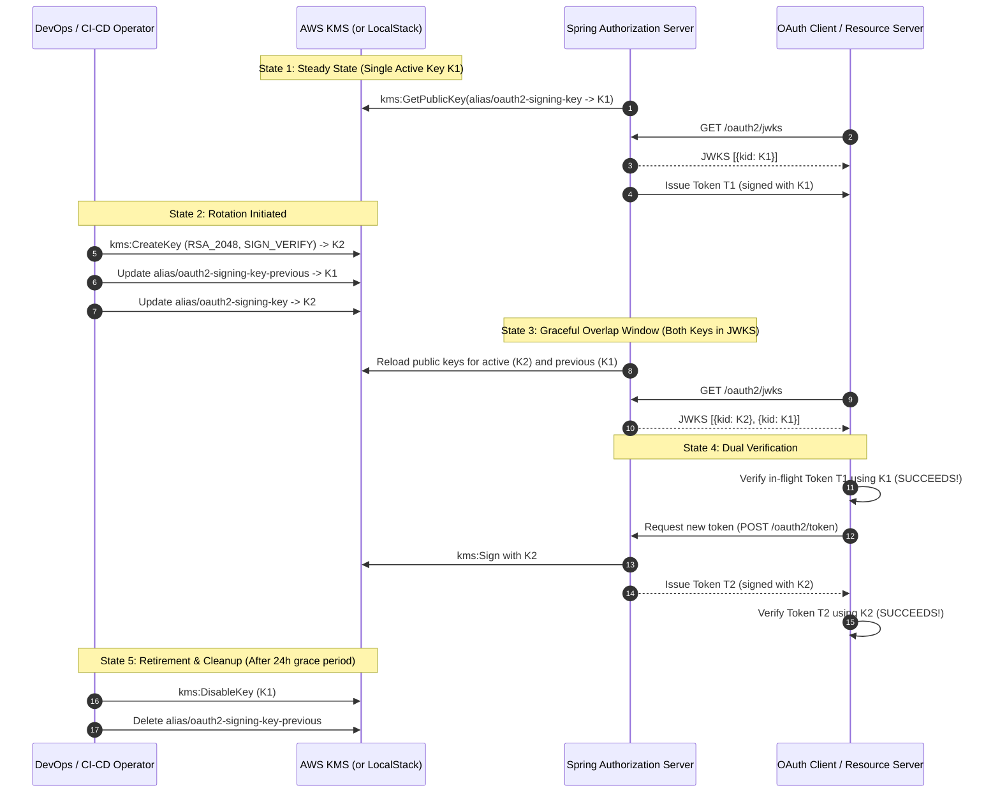

# AWS KMS Asymmetric Key Management, Multi-Key JWKS Rotation & Algorithm Pinning

This document details the cryptographic architecture, zero-downtime multi-key rotation lifecycle, and strict algorithm pinning implemented across the OAuth 2.1 & OpenID Connect platform using **AWS Key Management Service (KMS)** and **Spring Authorization Server**.

---

## 1. Architectural Overview & Cryptographic Boundary

```mermaid
flowchart TD
    subgraph KMS ["AWS KMS / LocalStack HSM Cryptographic Boundary (FIPS 140-2 Level 3)"]
        ActiveKey["Active Asymmetric Key (RSA_2048)\nAlias: alias/oauth2-signing-key\n(KeyUsage: SIGN_VERIFY)\n• Signs all newly minted tokens\n• Private Key NEVER leaves HSM"]
        PreviousKey["Previous Asymmetric Key (RSA_2048)\nAlias: alias/oauth2-signing-key-previous\n(KeyUsage: SIGN_VERIFY)\n• Retained during overlap window\n• Signs no new tokens"]
    end

    subgraph SpringServer ["Spring Authorization Server (:9000)"]
        KeyConfig["KeyConfig & JWKSource\n• Resolves active public key: kms-auth-server-key-1\n• Resolves previous public key: kms-auth-server-key-previous\n• Caches public keys in-memory"]
        KmsSigner["KmsRsaSigner & KmsJwtEncoder\n• Delegates sign requests to active KMS key\n• Automatic retries (3x) with full jitter\n• Strict Fail-Closed (no local fallback)"]
        AlgValidator["Strict Algorithm Pinning (RFC 8725 §3.1)\n• Checks JWS header alg == 'RS256'\n• Explicitly rejects 'none', HS256, etc."]
        JwksEndpoint["GET /oauth2/jwks\nPublishes [{kid: active}, {kid: previous}]"]
    end

    subgraph ClientsAndRS ["OAuth Clients & Resource Servers"]
        DemoClient["Demo Client (:8080)\n• In-Memory JWKS cache (auto-refreshes on unknown kid)\n• Strict algorithm pinning ('RS256')"]
        ResourceServer["Resource Servers / Microservices\n• Validates ID tokens & access tokens against JWKS"]
    end

    ActiveKey -->|kms:GetPublicKey (Startup/Cached)| KeyConfig
    PreviousKey -->|kms:GetPublicKey (Startup/Cached)| KeyConfig
    KeyConfig --> JwksEndpoint
    JwksEndpoint -->|Public JWKS| DemoClient
    JwksEndpoint -->|Public JWKS| ResourceServer
    SpringServer -->|kms:Sign (Digest over HTTP RPC)| ActiveKey
```

---

## 2. Zero-Downtime Multi-Key Rotation Lifecycle

When rotating cryptographic signing keys, terminating the old key immediately causes verification failures for clients or resource servers holding valid, in-flight tokens (which have an active TTL, e.g. 15 minutes).

Our architecture implements **Graceful Multi-Key Overlap Rotation**:



---

## 3. Key Transition State Machine

```mermaid
stateDiagram-v2
    [*] --> Active: Generated in KMS & assigned to alias/oauth2-signing-key
    Active --> Retiring: New key generated; alias/oauth2-signing-key-previous assigned
    note right of Active
        Used for signing new tokens.
        Published in /oauth2/jwks.
    end note
    
    Retiring --> Disabled: Grace period expired (e.g. 24 hours >= max token TTL)
    note right of Retiring
        No new tokens signed with this key.
        Still published in /oauth2/jwks
        to verify in-flight tokens.
    end note

    Disabled --> [*]: Scheduled for deletion in AWS KMS (7–30 days)
    note right of Disabled
        Removed from JWKS.
        Key cryptographically disabled.
    end note
```

---

## 4. Strict Algorithm Pinning (RFC 8725 Section 3.1)

### Threat Mitigation: Algorithm Confusion Attacks
In standard JWT libraries, if an endpoint does not enforce strict algorithm pinning, attackers can exploit **Algorithm Confusion**:
1. **The "none" Algorithm Attack:** The attacker sets `"alg": "none"` in the JWT header, strips the signature, and submits the token. Insecure verifiers accept the token as valid without verifying any signature.
2. **Key Confusion / HMAC Attack:** If the authorization server uses RSA and an attacker has access to the server's public key, the attacker signs a forged token using `HS256` (HMAC-SHA256) with the *RSA public key PEM* as the symmetric shared secret. If the verifier dynamically chooses the algorithm from the header, it uses its public key as the HMAC secret and accepts the forged token!

### Platform Defense Implementation:
Across all components, algorithm dynamic switching is completely disabled:
1. **Spring Authorization Server (`AuthorizationServerConfig.java`):**
   - Client Assertion decoder explicitly pins:
     ```java
     NimbusJwtDecoder.withPublicKey(clientKey)
         .signatureAlgorithm(SignatureAlgorithm.RS256)
         .build();
     ```
   - Validates that `jwt.getHeaders().get("alg")` strictly equals `"RS256"`, rejecting any token containing `"none"`, `"HS256"`, or non-approved algorithms with `invalid_client_assertion`.
2. **Spring Resource Server & Token Introspection (`KeyConfig.java`):**
   - Attaches `algorithmValidator` verifying that every token processed by `jwtDecoder` uses strictly `"RS256"`.
3. **Demo Client (`par_oauth2_client.rb`):**
   - Checks the raw JWS header prior to verification:
     ```ruby
     alg = header["alg"]
     if alg.blank? || alg.downcase == "none" || alg != "RS256"
       raise "Security Error: Strict Algorithm Pinning: Only 'RS256' algorithm is permitted."
     end
     ```
   - Passes `algorithms: ["RS256"]` to `JWT.decode`.

---

## 5. Operational Step-by-Step Key Rotation Guide

### Automated Script
The platform includes an automated rotation script:
```bash
bash scripts/rotate_kms_keys.sh
```

### Manual Procedure (AWS CLI / LocalStack)

#### Step 1: Check Current Active Key
```bash
awslocal kms list-aliases --query "Aliases[?AliasName=='alias/oauth2-signing-key'].TargetKeyId" --output text
# Example output: 8f9e064c-7de7-4db3-a8f3-703cc083754a
```

#### Step 2: Create the New Asymmetric Key in KMS
```bash
NEW_KEY_ID=$(awslocal kms create-key \
  --key-spec RSA_2048 \
  --key-usage SIGN_VERIFY \
  --description "Rotated OAuth 2.1 Signing Key" \
  --query 'KeyMetadata.KeyId' \
  --output text)
```

#### Step 3: Re-point Previous Alias to the Old Key
```bash
awslocal kms update-alias \
  --alias-name alias/oauth2-signing-key-previous \
  --target-key-id "8f9e064c-7de7-4db3-a8f3-703cc083754a"
```

#### Step 4: Promote New Key to Active Alias
```bash
awslocal kms update-alias \
  --alias-name alias/oauth2-signing-key \
  --target-key-id "$NEW_KEY_ID"
```

#### Step 5: Verify Multi-Key JWKS Output
```bash
curl -s http://localhost:9000/oauth2/jwks | jq .
```
Expected output showing both active and retiring keys:
```json
{
  "keys": [
    {
      "kty": "RSA",
      "kid": "kms-auth-server-key-1",
      "n": "...",
      "e": "AQAB"
    },
    {
      "kty": "RSA",
      "kid": "kms-auth-server-key-previous",
      "n": "...",
      "e": "AQAB"
    }
  ]
}
```

#### Step 6: Decommissioning the Old Key (After 24-Hour Grace Period)
Once all access tokens and ID tokens issued under the old key have expired (maximum TTL reached):
```bash
awslocal kms disable-key --key-id "8f9e064c-7de7-4db3-a8f3-703cc083754a"
awslocal kms delete-alias --alias-name alias/oauth2-signing-key-previous
```
