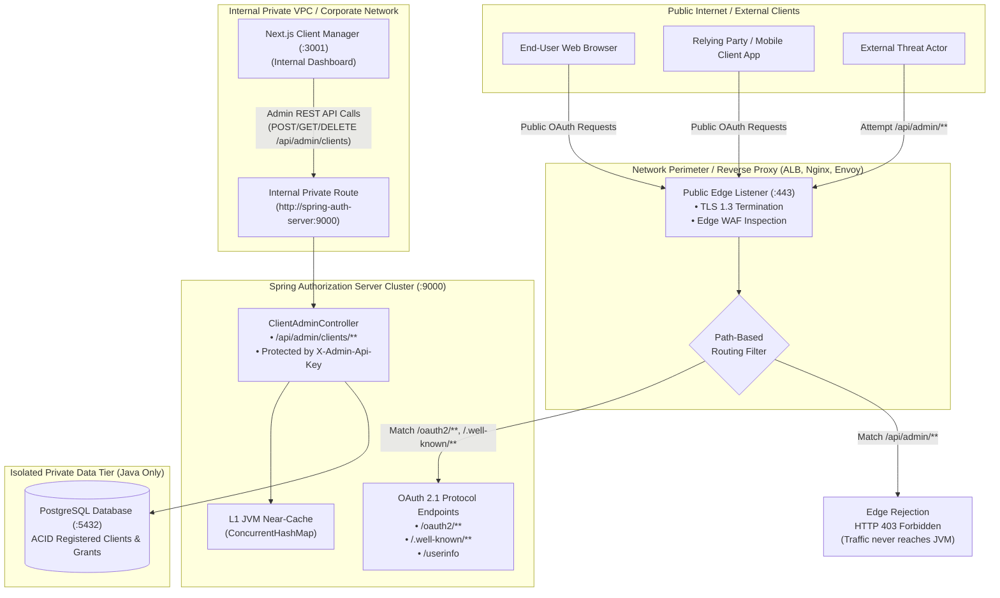

# Network Perimeter & Reverse Proxy Routing Architecture

This document defines the network boundary and edge routing architecture for the OAuth 2.1 & OpenID Connect platform, detailing how an **external reverse proxy / Application Load Balancer (ALB)** isolates internal administrative operations (`/api/admin/**`) from the public internet while keeping standard OAuth 2.1 endpoints publicly accessible.

---

## 1. Network Boundary Topology

The platform operates across two distinct network trust zones:
1. **Public Zone (Internet-Facing):** Relying party clients, mobile applications, resource servers, and end-user browsers accessing standard OAuth 2.1 / OIDC flows.
2. **Private Zone (Internal VPC / Enterprise Network):** Internal microservices, DevOps operators, and the **Next.js Client Manager** performing client onboarding, key rotation, and administrative revocation.



---

## 2. Endpoint Classification & Access Matrix

All routes served by `spring-auth-server` fall into one of two exposure categories:

| Endpoint Path | Method | Purpose | Exposure Classification | Edge Proxy Action | In-App Security Enforced |
|---|---|---|---|---|---|
| `/.well-known/openid-configuration` | `GET` | OIDC Provider Discovery | **Public** | **ALLOW** | Byte-array cache + ETag / 304 |
| `/.well-known/oauth-authorization-server` | `GET` | OAuth 2.1 Metadata Discovery | **Public** | **ALLOW** | Byte-array cache + ETag / 304 |
| `/oauth2/jwks` | `GET` | Public key set for token verification | **Public** | **ALLOW** | Multi-Key JWKS + ETag / 304 |
| `/oauth2/authorize` | `GET` | Interactive authorization start | **Public** | **ALLOW** | Shared session / Rails SSO check |
| `/oauth2/par` | `POST` | Pushed Authorization Requests | **Public** | **ALLOW** | `private_key_jwt` + DPoP + PKCE |
| `/oauth2/token` | `POST` | Authorization code exchange | **Public** | **ALLOW** | `private_key_jwt` + DPoP + PKCE |
| `/oauth2/revoke` | `POST` | RFC 7009 Token Revocation | **Public** | **ALLOW** | `private_key_jwt` assertion |
| `/oauth2/introspect` | `POST` | RFC 7662 Token Introspection | **Public** | **ALLOW** | `private_key_jwt` assertion |
| `/userinfo` | `GET` | RFC 9449 User Profile Claims | **Public** | **ALLOW** | Sender-constrained DPoP token |
| `/api/admin/clients` | `GET` | List all registered clients | **Internal Only** | **BLOCK (403/404)** | Constant-time `X-Admin-Api-Key` |
| `/api/admin/clients` | `POST` | Register or update OAuth client | **Internal Only** | **BLOCK (403/404)** | Constant-time `X-Admin-Api-Key` |
| `/api/admin/clients/{id}` | `GET` | Inspect full client details | **Internal Only** | **BLOCK (403/404)** | Constant-time `X-Admin-Api-Key` |
| `/api/admin/clients/{id}` | `DELETE` | Revoke & delete registered client | **Internal Only** | **BLOCK (403/404)** | Constant-time `X-Admin-Api-Key` |
| `/actuator/**` | `GET` | Health, metrics, & JVM telemetry | **Internal Only** | **BLOCK (403/404)** | Spring Actuator security |

---

## 3. Reverse Proxy Configuration Templates

Below are enterprise-grade configuration examples for restricting administrative endpoints at the perimeter.

### A. AWS Application Load Balancer (ALB) Listener Rules

In an AWS deployment, configure listener rules on the internet-facing ALB:

1. **Rule 1 (High Priority - Block Administrative Paths at Edge):**
   - **IF:** `Path is /api/admin/*` OR `Path is /actuator/*`
   - **THEN:** Return Fixed Response:
     - **Response Code:** `403`
     - **Content-Type:** `application/json`
     - **Response Body:** `{"error":"forbidden","message":"Administrative endpoints are restricted to internal networks."}`

2. **Rule 2 (Default - Route Public OAuth Endpoints):**
   - **IF:** `Path is /oauth2/*` OR `Path is /.well-known/*` OR `Path is /userinfo`
   - **THEN:** Forward to `tg-spring-auth-server-9000`

3. **Internal Routing:**
   - Deploy an **Internal (Private) ALB** or ECS Service Discovery namespace (e.g. `spring-auth-server.internal.corp`).
   - The Next.js Client Manager container targets `http://spring-auth-server.internal.corp:9000`, allowing it to reach `/api/admin/clients` without traversing the public ALB.

---

### B. Nginx Reverse Proxy Configuration

If Nginx terminates TLS in front of the application cluster:

```nginx
# /etc/nginx/conf.d/spring_auth_server.conf

# Define internal trusted subnets (VPC / VPN / Next.js container)
geo $is_internal_network {
    default        0;
    127.0.0.1/32   1;
    10.0.0.0/8     1;
    172.16.0.0/12  1;
    192.168.0.0/16 1;
}

server {
    listen 443 ssl http2;
    server_name auth.example.com;

    ssl_certificate     /etc/ssl/certs/auth_server.crt;
    ssl_certificate_key /etc/ssl/private/auth_server.key;

    # 1. Standard Public OAuth 2.1 / OIDC endpoints
    location / {
        proxy_pass http://spring_auth_backend;
        proxy_set_header Host $host;
        proxy_set_header X-Real-IP $remote_addr;
        proxy_set_header X-Forwarded-For $proxy_add_x_forwarded_for;
        proxy_set_header X-Forwarded-Proto $scheme;
    }

    # 2. Administrative client configuration endpoints (Restricted)
    location /api/admin/ {
        if ($is_internal_network = 0) {
            return 403 '{"error":"forbidden","message":"Administrative endpoints are not externally accessible"}';
        }

        proxy_pass http://spring_auth_backend;
        proxy_set_header Host $host;
        proxy_set_header X-Real-IP $remote_addr;
        proxy_set_header X-Forwarded-For $proxy_add_x_forwarded_for;
        proxy_set_header X-Forwarded-Proto $scheme;
    }

    # 3. Spring Actuator telemetry (Restricted)
    location /actuator/ {
        if ($is_internal_network = 0) {
            return 403 '{"error":"forbidden","message":"Actuator telemetry is restricted"}';
        }

        proxy_pass http://spring_auth_backend;
    }
}
```

---

### C. Kubernetes Ingress (Ingress-NGINX / Envoy Gateway)

In Kubernetes architectures, decouple public and private access into two distinct Ingress resources:

```yaml
# 1. Public Ingress (Bound to External Cloud Load Balancer)
apiVersion: networking.k8s.io/v1
kind: Ingress
metadata:
  name: spring-auth-public-ingress
  annotations:
    kubernetes.io/ingress.class: nginx
    nginx.ingress.kubernetes.io/ssl-redirect: "true"
spec:
  rules:
  - host: auth.example.com
    http:
      paths:
      # Expose only RFC standard authentication & discovery endpoints
      - path: /.well-known
        pathType: Prefix
        backend:
          service:
            name: spring-auth-server-svc
            port:
              number: 9000
      - path: /oauth2
        pathType: Prefix
        backend:
          service:
            name: spring-auth-server-svc
            port:
              number: 9000
      - path: /userinfo
        pathType: Prefix
        backend:
          service:
            name: spring-auth-server-svc
            port:
              number: 9000
---
# 2. Internal Ingress (Bound to Internal Private Load Balancer / VPN Only)
apiVersion: networking.k8s.io/v1
kind: Ingress
metadata:
  name: spring-auth-internal-ingress
  annotations:
    kubernetes.io/ingress.class: nginx-internal
    nginx.ingress.kubernetes.io/whitelist-source-range: "10.0.0.0/8,172.16.0.0/12"
spec:
  rules:
  - host: auth-internal.corp.local
    http:
      paths:
      - path: /api/admin
        pathType: Prefix
        backend:
          service:
            name: spring-auth-server-svc
            port:
              number: 9000
      - path: /actuator
        pathType: Prefix
        backend:
          service:
            name: spring-auth-server-svc
            port:
              number: 9000
```

---

### D. Cloudflare / Edge WAF Custom Rules

If utilizing Cloudflare in front of origin servers, define an **Edge WAF Custom Rule**:

- **Rule Name:** `Block External Access to Administrative APIs`
- **Expression:**
  ```
  (http.request.uri.path contains "/api/admin/" or http.request.uri.path contains "/actuator/")
  and not (ip.src in {10.0.0.0/8 172.16.0.0/12 192.168.0.0/16 <YOUR_CORPORATE_VPN_IPS>})
  ```
- **Action:** `Block`
- **Benefit:** Malicious requests are terminated at Cloudflare edge points-of-presence, never consuming application origin bandwidth or compute cycles.

---

## 4. Defense-in-Depth Guarantees

By delegating perimeter isolation to an external reverse proxy while maintaining application-level controls, the system achieves robust defense-in-depth:

1. **Path-Traversal Immunity:** Reverse proxies normalize URL paths (`/oauth2/../api/admin/clients` -> `/api/admin/clients`) prior to evaluating routing rules, mitigating URL canonicalization bypasses.
2. **Double-Layer Authentication:** Even if a proxy misconfiguration or internal network compromise occurs, `/api/admin/**` requests are still protected by Spring's ClientAdminController via constant-time `X-Admin-Api-Key` verification (`MessageDigest.isEqual`).
3. **Zero Database Exposure:** Under no circumstances is PostgreSQL reachable from external clients. Only the Java application holds database connections on port `5432`.
4. **Perimeter OWASP Response Headers:** In addition to Spring Security setting OWASP response headers (`X-Content-Type-Options: nosniff`, `X-Frame-Options: DENY`, `Content-Security-Policy: default-src 'none'; frame-ancestors 'none'`, and `Referrer-Policy: strict-origin-when-cross-origin`), configuring these headers at the edge reverse proxy guarantees that edge-generated responses (such as HTTP 403 blocks or 502/504 gateway errors) maintain identical security postures before reaching client browsers.

