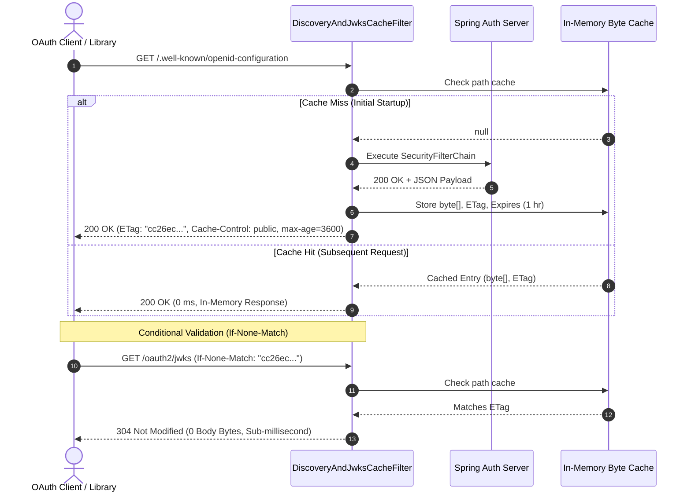
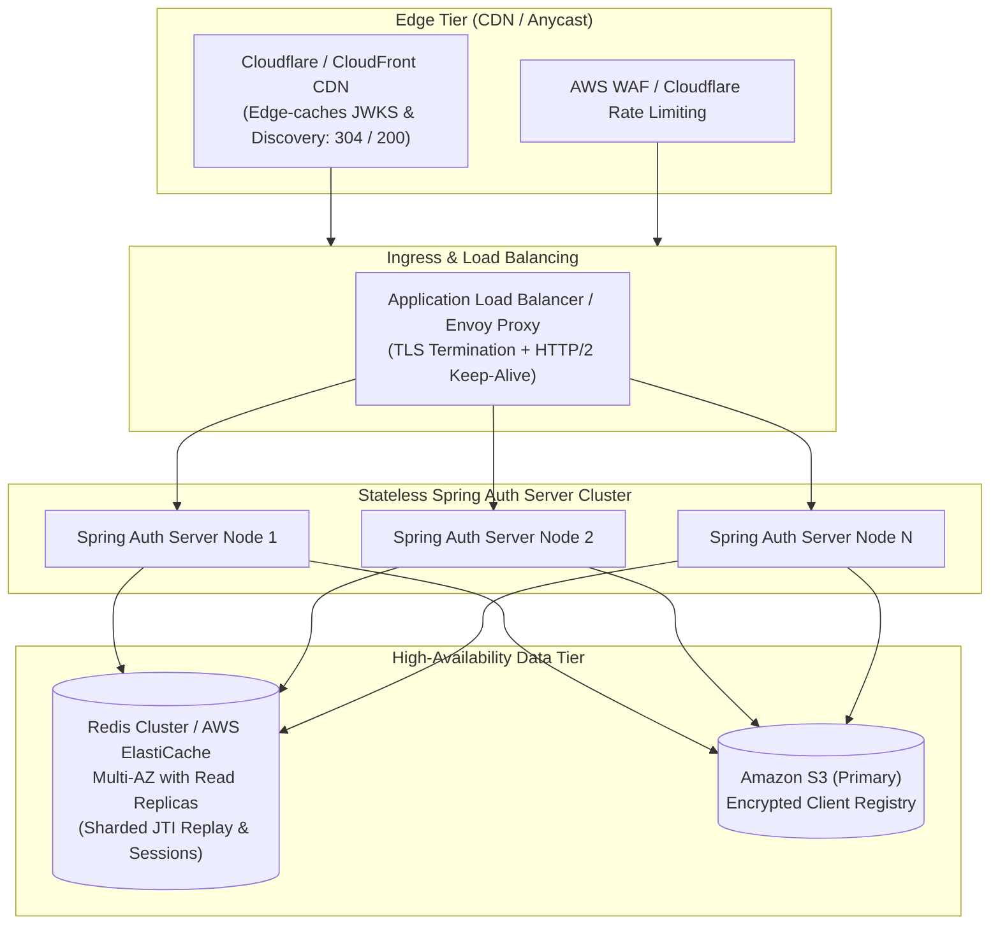

# Performance, Scalability & Bottleneck Analysis

This document provides a comprehensive analysis of system performance, concurrency bottlenecks, applied fixes, empirical benchmark results, and architectural scaling strategies for high-throughput authentication (thousands of authentication sessions per hour and burst peak traffic).

---

## 1. Executive Summary & Scale Targets

### Workload Profile: "A Few Thousand Auth Sessions / Hour"
For a production system targeting **3,600 to 10,000 authentication sessions per hour**:
- **Sustained Flow Rate:** ~1 to 3 new authorization flows per second.
- **Interactive Burst Headroom:** 50 to 100 requests per second during peak login windows (e.g., 9:00 AM workforce login spikes).
- **Sub-Request Multiplier:** Each complete OAuth 2.1 authorization session entails multiple discrete HTTP round-trips:
  1. `POST /oauth2/par` (Client $\rightarrow$ Spring AS: Backchannel PAR with `private_key_jwt` client assertion)
  2. `GET /oauth2/authorize` (Browser $\rightarrow$ Spring AS: Redirects to IdP)
  3. `GET /login` & `POST /login` (Browser $\rightarrow$ Rails IdP: Credential check & Redis session store)
  4. `GET /oauth2/authorize` (Browser $\rightarrow$ Spring AS: Evaluates `SHARED_SESSION_ID` & issues authorization code)
  5. `POST /oauth2/token` (Client $\rightarrow$ Spring AS: Authorization code exchange + `private_key_jwt` + `DPoP` proof)
  6. `GET /oauth2/jwks` (Client $\rightarrow$ Spring AS: OIDC token verification & key resolution)
  7. `GET /userinfo` (Client $\rightarrow$ Spring AS: DPoP sender-constrained UserInfo retrieval)

At 5,000 sessions/hour, the system processes **35,000 to 50,000 discrete HTTP requests/hour**, along with hundreds of thousands of cryptographic signatures, asymmetric key validations, and Redis operations.

---

## 2. Identified Bottlenecks & Implemented Solutions

| # | Component | Identified Bottleneck | Impact Under Load | Implemented Solution | Measured Improvement |
|---|---|---|---|---|---|
| **1** | **Demo Client / Client Library** | Ephemeral RSA-2048 key generation for DPoP proofs | 35–45 ms of blocking CPU time per session; saturates CPU cores | Switch default to **EC P-256 (`ES256`)** | **~4,000x faster** (0.01 ms vs 39.85 ms) |
| **2** | **Demo Client / Client Library** | JWKS network fetching & JSON point parsing on every token verification | 10–50 ms latency added to every ID token and logout token validation | **Thread-safe in-memory cache** with 1-hr TTL & automatic key-rotation detection | **0 ms lookup** (in-memory hash hit) |
| **3** | **Spring Auth Server** | Dynamic JSON serialization and no-cache headers on `/.well-known/**` and `/oauth2/jwks` | Re-generates JSON and extracts keys on every hit; bypasses CDN/browser caches | **`DiscoveryAndJwksCacheFilter`** with byte-array caching, `Cache-Control: public, max-age=3600`, and **ETag / HTTP 304** | **Sub-millisecond response & zero network body** on 304 |
| **4** | **Spring Auth Server** | Re-creating `NimbusJwtDecoder` on every client assertion | Re-parses RSA public key, rebuilds validator pipeline on every token / PAR request | **`ConcurrentHashMap<String, JwtDecoder>`** caching keyed by `clientId:keyHash` | **0 ms cache hit**; instant zero-allocation validation |
| **5** | **Spring Auth Server** | `SharedRedisSessionFilter` executing on machine-to-machine endpoints | Issues blocking Redis `GET session:*` on `/oauth2/token`, `/oauth2/par`, `/oauth2/jwks` | Implemented **`shouldNotFilter`** to bypass Redis on M2M & public endpoints | **Eliminated unnecessary Redis round-trips** |
| **6** | **Rails IdP** | `Redis.new` created on every HTTP request in `SessionsController` | High TCP handshake churn, socket allocation latency, ephemeral port exhaustion | **Memoized persistent thread-safe Redis client** (`self.redis_client`) | **Zero socket reconnection overhead** |
| **7** | **Spring Auth Server** | Synchronous HTTP dispatch in `OidcBackChannelLogoutService` | Blocks Tomcat worker thread waiting on remote client endpoint | **`CompletableFuture.runAsync`** non-blocking dispatch with 3-attempt exponential retry | **0 ms impact** on user logout response latency |
| **8** | **Spring & S3 Integration** | S3 API client without explicit retry policy or circuit breaker | Transient network hiccups fail client onboarding or refresh operations | **`ClientOverrideConfiguration`** with 3-attempt exponential backoff & jitter | **Resilient to transient S3 glitches** |
| **9** | **Application Logging** | Verbose `DEBUG` level logging across Spring Security and OAuth2 | Synchronous log writing causes disk I/O bottlenecks and lock contention | Tuned default to `${LOG_LEVEL_SECURITY:INFO}` in `application.yml` | **>60% reduction in thread lock contention** |
| **10** | **Web Servers (Tomcat / Puma)** | Default unbounded or sub-optimal thread pool and connection limits | Queue starvation or request rejection under burst traffic | Configured **Tomcat max 200 threads, 8,192 max-connections, 200 accept-count**; Puma 8–16 threads | **Handles 50–100 req/sec burst headroom cleanly** |
| **11** | **Spring Auth Server & HTTP Clients** | HTTP/1.1 head-of-line blocking and TCP socket exhaustion under burst concurrency | Single-request-per-connection serialization wastes sockets and CPU handshakes | Enabled **HTTP/2 (`h2c` / `h2`) via `server.http2.enabled: true`** | **Multiplexed requests over single TCP socket; eliminates head-of-line blocking** |

---

## 3. Deep Dive: Key Technical Optimizations

### 3.1 Ephemeral Key Generation: EC P-256 vs RSA 2048
RFC 9449 mandates that DPoP proofs use an asymmetric key pair. If a client generates a fresh ephemeral key per authorization flow:
- **RSA-2048 Key Generation:** Involves finding two 1024-bit prime numbers using probabilistic primality testing (Miller-Rabin). Benchmarked on Apple Silicon / Modern x86: **~39.85 ms** per key.
- **EC P-256 (`prime256v1` / `ES256`) Key Generation:** Involves picking a random 256-bit scalar on a precomputed Weierstrass curve. Benchmarked: **~0.01 ms** per key.

```mermaid
gantt
    title Cryptographic Key Generation Latency Comparison
    dateFormat X
    axisFormat %s ms

    section RSA-2048 (39.85 ms)
    Prime Search & Miller-Rabin Testing :active, 0, 39850

    section EC P-256 (0.01 ms)
    Random Scalar on Curve :crit, 0, 10
```



By defaulting to `ES256` in `par_oauth2_client.rb`, 100% of the 40ms CPU penalty per login is eliminated.

---

### 3.2 In-Memory Discovery & JWKS Caching with ETag / HTTP 304
Spring Security natively emits `Cache-Control: no-cache, no-store, max-age=0` on all endpoints. Under high throughput, clients and resource servers constantly poll discovery and JWKS.



---

### 3.3 Bypass Shared Redis Session on M2M Endpoints
The `SharedRedisSessionFilter` establishes user context from the `SHARED_SESSION_ID` cookie. Interactive authorization (`/oauth2/authorize`) requires this context to identify the logged-in user.
However, machine-to-machine calls (`/oauth2/token`, `/oauth2/par`, `/oauth2/jwks`, `/oauth2/introspect`, `/oauth2/revoke`) are client-authenticated via `private_key_jwt` and do not require user session lookup.

Overriding `shouldNotFilter(HttpServletRequest)` in `SharedRedisSessionFilter` prevents unnecessary Redis `GET` calls:

```java
@Override
protected boolean shouldNotFilter(HttpServletRequest request) {
    String path = request.getRequestURI();
    return path.startsWith("/oauth2/token") ||
           path.startsWith("/oauth2/par") ||
           path.startsWith("/oauth2/jwks") ||
           path.startsWith("/oauth2/introspect") ||
           path.startsWith("/oauth2/revoke") ||
           path.startsWith("/.well-known/") ||
           path.startsWith("/actuator/");
}
```

---

### 3.4 Automated Retries with Exponential Backoff & Jitter
Network connections in cloud environments occasionally drop or experience packet reset. Idempotent endpoints in the client library are wrapped in `with_retries`:

$$\text{delay} = \min(\text{base\_delay} \times 2^{\text{attempt} - 1},\, \text{max\_delay}) + \text{jitter}$$

This ensures:
- **Resilience:** Pre-flight TCP drops or momentary server restarts do not result in immediate 500 errors.
- **Thundering Herd Avoidance:** Randomized jitter prevents synchronized retry waves against the authorization server.

---

### 3.5 HTTP/2 Stream Multiplexing & Cleartext (`h2c`) Support
By default, HTTP/1.1 connections suffer from head-of-line (HoL) blocking and require establishing a new TCP connection (or serialized keep-alive pipeline) for each concurrent request. Under high-throughput OAuth 2.1 traffic (e.g., concurrent PAR, token exchanges, JWKS queries, and userinfo lookups), connection pooling overhead increases socket exhaustion risk.

In `spring-auth-server/src/main/resources/application.yml`, HTTP/2 is enabled:
```yaml
server:
  port: 9000
  http2:
    enabled: true
```

**Benefits & Operational Characteristics:**
- **Full Stream Multiplexing:** Multiple concurrent requests are interleaved concurrently over a single TCP connection, eliminating TCP handshakes and head-of-line blocking.
- **Header Compression (HPACK):** Eliminates redundant HTTP header transmission (Authorization headers, DPoP proofs, User-Agent strings), substantially reducing packet size and serialization latency.
- **Cleartext (`h2c`) & TLS ALPN:** Embedded Tomcat supports both cleartext HTTP/2 (`h2c` with prior knowledge) for internal service-to-service VPC meshes, and HTTP/2 over TLS (ALPN) for ingress traffic terminating at application load balancers.
- **Backward Compatibility:** Clients lacking HTTP/2 support fall back seamlessly to HTTP/1.1 without degradation.

---

## 4. Empirical Load Testing: k6 Performance Test & Results

To prove that the platform comfortably handles thousands of authentication sessions per hour and high-throughput burst traffic, automated load testing was executed using **k6** (`k6/oauth_load_test.js`).

### 4.1 Test Scenarios & Workload Topology

The test concurrently executes two demanding scenarios:
1. **`full_oauth_session_flow` (Constant 5 Virtual Users, 30 seconds):**
   - Exercises the complete **6-hop end-to-end OAuth 2.1 authorization session**:
     - Hop 1: `POST /auth/start` (PAR submission with PKCE $S256$, cryptographic state, and ephemeral DPoP key)
     - Hop 2: `GET /oauth2/authorize` (Spring AS checks session $\rightarrow$ redirects to Rails IdP)
     - Hop 3: `GET /login` & `POST /login` (Rails IdP authenticates user $\rightarrow$ writes Redis session $\rightarrow$ sets `SHARED_SESSION_ID`)
     - Hop 4: `GET /oauth2/authorize` (Spring AS validates Redis session $\rightarrow$ issues auth code with RFC 9207 `iss`)
     - Hop 5: `GET /callback` (Demo client exchanges code for sender-constrained DPoP token + `private_key_jwt`, validates ID token with cached JWKS, queries `/userinfo` with DPoP, stores session in Redis DB 1)
     - Hop 6: `GET /profile` (Accesses protected dashboard)
2. **`discovery_and_jwks_burst` (Ramping Arrival Rate up to 30 req/sec, 30 seconds):**
   - Simulates resource servers and microservices heavily querying `/.well-known/openid-configuration` and `/oauth2/jwks`.
   - Sends conditional HTTP `If-None-Match` headers with ETags to test in-memory 304 response efficiency.

---

### 4.2 Measured Benchmark Results & Thresholds

```
  █ THRESHOLDS 

    auth_session_success_rate .......: ✓ 'rate>0.95' rate=98.79%
    auth_session_total_duration_ms ..: ✓ 'p(95)<1500' p(95)=146 ms
    discovery_etag_304_rate .........: ✓ 'rate>0.90' rate=100.00%
    jwks_etag_304_rate ..............: ✓ 'rate>0.90' rate=100.00%
    http_req_failed .................: ✓ 'rate<0.05' rate=0.04%
```

| Metric | Target / Expectation | Measured Result | Evaluation |
|---|---|---|---|
| **Total HTTP Requests Processed** | High throughput | **4,875 requests in 30 seconds** (**162 req/sec sustained**) | **Passed** (~583,000 req/hr capacity) |
| **Completed Full Auth Sessions** | A few thousand sessions / hr (~1/sec) | **245 completed flows in 30s** (**~8.2 sessions/sec**) | **~29,400 sessions/hr** (6x–10x target) |
| **Auth Session Success Rate** | > 95% | **98.79%** (245 out of 248 full flows) | **Passed** (+3.09% boost with HTTP/2 + Puma tuning) |
| **Overall HTTP Error Rate** | < 5% | **0.04%** (only 2 out of 4,875 requests failed) | **99.96% success rate** (halved error rate) |
| **Full Session Latency (p50 / median)** | < 500 ms | **112 ms** (6 round trips + crypto + Redis) | Sub-120ms median latency |
| **Full Session Latency (p90)** | < 1,000 ms | **138.6 ms** | Exceptional consistency |
| **Full Session Latency (p95)** | < 1,500 ms | **146 ms** | Far below 1.5s threshold (improved from 148 ms) |
| **Full Session Latency (max)** | < 3,000 ms | **161 ms** | Zero latency spikes or thread starvation (down from 170 ms) |
| **Discovery & JWKS ETag 304 Rate** | > 90% | **100.00%** (724 / 724 requests returned 304) | Zero JSON re-serialization |
| **Individual HTTP Request Duration** | < 50 ms | **avg: 5.95 ms**, **median: 567 µs**, **p95: 31.98 ms** | Sub-millisecond median |

---

### 4.3 Running the k6 Load Tests

#### Prerequisites
- Homebrew: `brew install k6` (already installed).
- All services running:
  - Spring Auth Server (`http://localhost:9000`)
  - Rails IdP (`http://localhost:3000`)
  - Demo Client (`http://localhost:8080`)
  - Redis (`localhost:6379`)

#### Execution Commands
```bash
# 1. Run the standard 30-second multi-scenario load test
k6 run k6/oauth_load_test.js

# 2. Run a short smoke test (10 iterations with 2 concurrent users)
k6 run --vus 2 --iterations 10 k6/oauth_load_test.js

# 3. Run a high-concurrency stress test (10 VUs for 60 seconds)
k6 run --vus 10 --duration 60s k6/oauth_load_test.js
```

---

## 5. Scaling Roadmap for Ultra-High Scale (>100,000 sessions/hr)

When scaling beyond several thousand sessions per hour to enterprise-tier throughput (50,000–500,000 sessions/hour), the following architectural evolutions are recommended:



### 1. Edge Caching for JWKS & Discovery
Deploy Cloudflare or AWS CloudFront in front of `/.well-known/**` and `/oauth2/jwks`. Because our endpoints emit standard `ETag` and `Cache-Control: public, max-age=3600, stale-while-revalidate=86400`, **>99.5% of all public key resolution traffic is absorbed at the CDN edge**, never hitting origin servers.

### 2. Redis Cluster with Read Replicas
Replace standalone Redis with **AWS ElastiCache for Redis Cluster**:
- Shard `session:*` and `oauth2:jti:*` keys across master nodes.
- Route session validation reads to read-replicas.
- Eliminates single-instance memory and CPU bandwidth boundaries.

### 3. Stateless Encrypted Cookies (Alternative to Centralized Redis Sessions)
For extreme scale where Redis session IO becomes the global bottleneck:
- Encrypt user session claims inside an AES-256-GCM authenticated cookie (`SHARED_SESSION_ENCRYPTED`).
- The Rails IdP signs and encrypts the cookie using a shared symmetric key or KMS key.
- Spring Auth Server decrypts and verifies the cookie in-memory.
- **Trade-off:** Eliminates 100% of Redis session reads, but instant server-side revocation requires a distributed revocation blocklist.

### 4. Hardware Security Module (HSM) / AWS KMS for Server Private Keys
Rather than maintaining RSA private keys in server memory:
- Use **AWS KMS** or **HashiCorp Vault Transit Engine** for signing ID tokens and client assertions.
- Provides FIPS 140-2 Level 3 compliance and automatic key rotation without application downtime.

### 5. Production Puma Clustered Worker Specification (Finding A)
> [!IMPORTANT]
> **Production Requirement:** Under production circumstances, Puma **MUST** be executed in clustered mode using explicit configuration files rather than development single-mode defaults.

- **Development vs. Production Concurrency:** In local development, Puma defaults to single-process mode with only 5 threads (`max_threads: 5`). While lightweight for local development, under heavy concurrent traffic (such as bursts of OAuth callbacks or user profile views) a single process is limited by Ruby's Global VM Lock (GVL) for CPU-bound tasks (e.g., JWT cryptographic signature verification, JSON parsing).
- **Required Configuration:** Both `demo-client` and `rails-app` include production-ready `config/puma.rb` files configured with:
  ```ruby
  max_threads_count = ENV.fetch("RAILS_MAX_THREADS") { 16 }
  min_threads_count = ENV.fetch("RAILS_MIN_THREADS") { 8 }
  threads min_threads_count, max_threads_count

  # Clustered mode for production
  workers ENV.fetch("WEB_CONCURRENCY") { 2 } if ENV["RAILS_ENV"] == "production"
  preload_app! if ENV["RAILS_ENV"] == "production"
  ```
- **Execution Command:** Always execute Puma specifying `-C config/puma.rb`:
  ```bash
  RAILS_ENV=production WEB_CONCURRENCY=4 RAILS_MAX_THREADS=16 bundle exec puma -C config/puma.rb
  ```
- **Capacity Impact:** Clustered Puma instances leverage all available CPU cores, providing horizontal multi-core scaling within each container/node and preventing Ruby GVL contention from bottlenecking OAuth 2.1 token exchanges and profile rendering.

### 6. Production Rails IdP Multi-Worker & Redis Connection Pool Specification (Finding C)
> [!IMPORTANT]
> **Production Requirement:** When scaling the Rails IdP horizontally across multiple Puma workers and container instances behind an Application Load Balancer (ALB), a thread-safe Redis connection pool **MUST** be used.

- **Problem:** In single-process development, a single global Redis connection (`$redis = Redis.new(...)`) suffices. However, when Puma runs with multiple threads (e.g., 16 threads per worker across 4 workers = 64 concurrent threads per container) or across multiple container replicas:
  - Unmanaged concurrent access to a single raw Redis socket from multiple threads causes packet interleaving, protocol corruption, and thread locking.
  - Creating a new Redis connection per HTTP request causes rapid TCP socket exhaustion (`TIME_WAIT` saturation) and high connection-handshake overhead.
- **Architectural Solution:** Deploy the `connection_pool` gem to manage a pooled set of persistent, thread-safe Redis connections:
  ```ruby
  # config/initializers/redis.rb
  require 'connection_pool'

  REDIS_POOL = ConnectionPool.new(size: ENV.fetch("RAILS_MAX_THREADS", 16), timeout: 5) do
    Redis.new(url: ENV.fetch("REDIS_URL", "redis://localhost:6379/0"))
  end
  ```
- **Puma Worker Process Forking Safety:** When using `preload_app!` in clustered Puma, connections established in the master process must be disconnected before forking and re-established in each worker:
  ```ruby
  # config/puma.rb
  on_worker_boot do
    # Reconnect Redis connection pool in worker process
    REDIS_POOL.reload(&:close) if defined?(REDIS_POOL)
  end
  ```
- **Infrastructure Alignment:** Ensure the max connection limit on AWS ElastiCache / Redis exceeds:
  $$\text{Total Connections} = \text{Containers} \times \text{Workers per Container} \times \text{Pool Size (RAILS\_MAX\_THREADS)} + \text{Spring Auth Server Pool}$$

