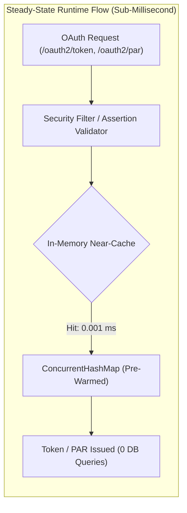
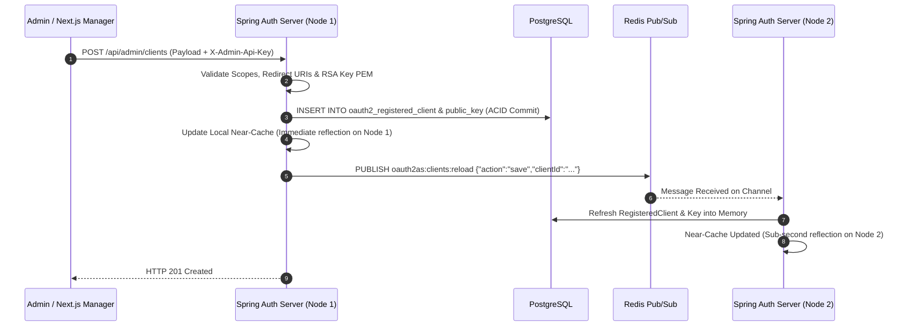

# PostgreSQL Persistence, High-Performance Near-Caching & Architecture Specification

## 1. Executive Summary & Architectural Rationale

This document details the introduction of **PostgreSQL** as the canonical, ACID-compliant persistence layer for Spring Authorization Server runtime state and registered client configurations, strictly adhering to the organizational policy that **only the Java application may communicate directly with PostgreSQL**.

> [!NOTE]
> **Implementation Status: Fully Implemented & Production-Active**
> PostgreSQL ACID persistence, Flyway schema migrations, Java-only network isolation, Spring Admin REST API (`/api/admin/clients`), and the L1 JVM near-cache are fully implemented across all components. AWS S3 has been completely deprecated and purged from the repository.

```
┌──────────────────────────────────────────────────────────────────────────────────┐
│                         ISOLATED PRIVATE DATA TIER                               │
│                                                                                  │
│                      ┌──────────────────────────────┐                            │
│                      │     PostgreSQL Database      │                            │
│                      │   (Docker: poc-postgres)     │                            │
│                      └──────────────▲───────────────┘                            │
│                                     │  (Port 5432 - Java Only)                   │
│                                     │  HikariCP Connection Pool                  │
└─────────────────────────────────────┼────────────────────────────────────────────┘
                                      │
┌─────────────────────────────────────┼────────────────────────────────────────────┐
│                             JAVA APPLICATION CLUSTER                             │
│                                     │                                            │
│                      ┌──────────────┴───────────────┐                            │
│                      │  Spring Authorization Server │                            │
│                      │     (Java 25 / Spring 7)     │                            │
│                      │                              │                            │
│                      │  ┌────────────────────────┐  │                            │
│                      │  │ In-Memory Near-Cache   │  │ <--- Sub-millisecond reads │
│                      │  │ (ConcurrentHashMap L1) │  │      (0.001 ms latency)    │
│                      │  └────────────────────────┘  │                            │
│                      └──────▲────────────────▲──────┘                            │
└─────────────────────────────┼────────────────┼───────────────────────────────────┘
                              │                │
            Admin REST API    │                │ Redis Pub/Sub Cluster Sync
    (X-Admin-Api-Key Auth)    │                │ (Channel: oauth2as:clients:reload)
                              │                │
┌─────────────────────────────┴────────┐ ┌─────┴───────────────────────────────────┐
│     Next.js Client Manager (3001)    │ │      Redis L2 Cache & Pub/Sub (6379)    │
│   (Zero DB Drivers / Zero AWS SDKs)  │ │   (Shared SSO Session, Hot Invalidation)│
└──────────────────────────────────────┘ └─────────────────────────────────────────┘
```

---

## 2. Why This Improvement Was Made

Prior to this architecture, the platform faced two major limitations:

### A. Vulnerability of In-Memory Runtime State
- **Previous State:** Active authorization codes, user consent records, and long-lived refresh tokens were held in JVM heap memory via `InMemoryOAuth2AuthorizationService`.
- **Problem:**
  - **Rolling Restarts & Deployments:** When application pods restarted or deployed new containers, all active refresh tokens were wiped, forcing users across all relying parties to re-authenticate.
  - **Horizontal Scaling:** Multi-pod deployments behind an Application Load Balancer (ALB) suffered from split-brain state: an authorization code issued on Pod A could not be exchanged at `/oauth2/token` on Pod B unless sticky sessions were enforced.
- **PostgreSQL Solution:** Transitioning to `JdbcOAuth2AuthorizationService` and `JdbcOAuth2AuthorizationConsentService` provides **ACID-durable storage**. Any pod in the cluster can validate authorization codes and rotate refresh tokens seamlessly.

### B. Why AWS S3 Was Deprecated and Completely Removed

In earlier iterations of the architecture, client configuration metadata was persisted as JSON files in AWS S3 (or LocalStack S3) and synchronized to Redis hashes. This design was formally deprecated and completely removed for five fundamental reasons:

1. **Strict Zero-Trust Network Perimeter (Organizational Policy Compliance):**
   - The organization strictly mandates that **only the Java application may communicate with persistent data stores**.
   - Allowing front-end management tiers (such as the Next.js Client Manager) to possess AWS credentials and directly read/write to S3 buckets violated this core security boundary.
   - By routing all client lifecycle operations through the Java-hosted **Spring Admin REST API** (`/api/admin/clients` secured with `X-Admin-Api-Key`), the Spring Authorization Server acts as a strict **Domain Gateway**. It cryptographically parses public keys, verifies redirect URI syntax, and validates authorized scopes *before* any record is committed.

2. **Elimination of Dual-Storage Fragility & Eventual Consistency:**
   - S3 object storage lacks transactional atomicity and two-phase commit capabilities. Writing to S3 and subsequently signaling Redis was inherently vulnerable to network partitions, partial failures, and clock drift.
   - Migrating client definitions to PostgreSQL (`oauth2_registered_client` and `oauth2_client_public_key`) provides single-source-of-truth ACID consistency.

3. **Performance & Network Latency Reduction:**
   - S3 REST API calls (`PutObject`, `GetObject`) introduce 20–50 ms of network latency per operation.
   - Under the PostgreSQL + In-Memory Near-Cache architecture, steady-state client lookups resolve in **~0.001 ms with zero network calls**, while administrative writes commit in under 2 ms with immediate sub-second cluster propagation via Redis Pub/Sub.

4. **Attack Surface & Dependency Minimization:**
   - Removing S3 enabled purging `@aws-sdk/client-s3` from `client-manager` and `software.amazon.awssdk:s3` from `spring-auth-server`.
   - This eradicated S3 bucket permission vulnerabilities, complex IAM bucket policy management, and dependencies on cloud-specific storage APIs.

5. **Infrastructure Consolidation:**
   - Because PostgreSQL was already required for durable runtime authorization codes, refresh tokens, and user consent, maintaining an additional S3 storage service was redundant overhead. LocalStack now runs strictly for AWS KMS hardware signing (`SERVICES=kms`).

### C. Zero-Trust Network Isolation (Organization Security Policy)
- In compliance with enterprise security requirements, **PostgreSQL is isolated from the public network and all front-end/application tiers**.
- Neither the Rails IdP, the Next.js Client Manager, nor relying parties (Demo Client) possess database credentials, database drivers, or network routes to PostgreSQL.
- The Java Spring application acts as the **validated Domain Gateway**, enforcing cryptographic key verification, redirect URI whitelisting, and scope constraints before any record touches PostgreSQL.

---

## 3. How High Performance Is Maintained (<1 ms Latency)

A common concern with moving OAuth clients to a relational database is that querying PostgreSQL on every incoming request (PAR, authorize, token exchange, client assertion verification, userinfo) would add 1–5 ms of database latency and cause connection pool starvation under heavy load.

The platform prevents this entirely through a **Multi-Tier Near-Cache Architecture**:



### 1. In-Memory Near-Cache (`PostgresRegisteredClientRepository`)
- All registered clients (`RegisteredClient`) and their parsed cryptographic public keys (`RSAPublicKey`) are pre-warmed from PostgreSQL into a thread-safe `ConcurrentHashMap` upon application startup.
- **Steady-State Reads:** All runtime calls (`findByClientId`, `findById`, `getClientPublicKey`) resolve directly from memory in **~0.001 ms**.
- **Zero Database Round-Trips:** Steady-state authentication, PAR validation, and token exchanges execute without issuing a single SQL query against PostgreSQL.

### 2. High-Performance HikariCP Connection Pooling
- For transactional writes (`JdbcOAuth2AuthorizationService` persisting authorization codes and tokens):
  - **Pool Size:** `maximum-pool-size: 20`, `minimum-idle: 5`.
  - **Connection Reuse:** Pre-allocated, persistent TCP sockets to PostgreSQL eliminate connection handshake latency.
  - **Connection Timeouts:** `connection-timeout: 30000ms`, `idle-timeout: 600000ms`, `max-lifetime: 1800000ms`.

### 3. B-Tree Token Indices
- Dedicated B-tree indices in `V1__create_oauth2_authorization_tables.sql` guarantee $O(\log N)$ lookup speed for runtime tokens:
  ```sql
  CREATE INDEX idx_oauth2_auth_code ON oauth2_authorization (authorization_code_value);
  CREATE INDEX idx_oauth2_access_token ON oauth2_authorization (access_token_value);
  CREATE INDEX idx_oauth2_refresh_token ON oauth2_authorization (refresh_token_value);
  CREATE INDEX idx_oauth2_state ON oauth2_authorization (state);
  ```

---

## 4. Enabling Quick Client Changes Across Clusters

Quick client provisioning, key rotation, and immediate revocation operate without sacrificing either durability or latency:



### Invalidation & Propagation Guarantee:
1. **Atomic Mutation:** A client update or deletion is written transactionally to PostgreSQL.
2. **Local Cache Eviction:** The node handling the mutation updates its `ConcurrentHashMap` immediately (zero-lag).
3. **Cluster Broadcast:** A lightweight JSON message is published to Redis Pub/Sub channel `oauth2as:clients:reload`.
4. **Sub-Second Synchronization:** All other cluster nodes receive the event and reload the updated definition from PostgreSQL within milliseconds.
5. **Zero Downtime:** Client additions, key rotations, and revocations take effect immediately across all nodes without requiring a server restart.

---

## 5. Java Administrative REST API

Because external services cannot connect to PostgreSQL, Spring Auth Server provides secure administrative endpoints protected by constant-time API key verification:

| Method | Endpoint | Description | Security |
|---|---|---|---|
| `GET` | `/api/admin/clients` | Lists summaries of all registered clients in PostgreSQL. | `X-Admin-Api-Key` header |
| `POST` | `/api/admin/clients` | Validates, registers, or updates a client; persists to DB; refreshes near-cache; broadcasts reload event. | `X-Admin-Api-Key` header |
| `DELETE` | `/api/admin/clients/{clientId}` | Deletes client from PostgreSQL; purges from near-cache; broadcasts reload event. | `X-Admin-Api-Key` header |

### Sample Payload (`POST /api/admin/clients`):
```json
{
  "clientId": "analytics-service",
  "clientName": "Analytics Microservice",
  "clientAuthenticationMethods": ["private_key_jwt"],
  "authorizationGrantTypes": ["client_credentials"],
  "scopes": ["openid", "analytics.read"],
  "requireProofKey": true,
  "requireAuthorizationConsent": false,
  "accessTokenTimeToLiveMinutes": 15,
  "publicKeyPem": "-----BEGIN PUBLIC KEY-----\nMIIBIjANBgkqhkiG9w0BAQEFAAOCAQ8A...\n-----END PUBLIC KEY-----"
}
```

---

## 6. Flyway Database Migration Architecture & Authorization Pruning

Database evolution is managed via Flyway migrations located in `src/main/resources/db/migration/`:

- **`V1__create_oauth2_authorization_tables.sql`:**
  - `oauth2_registered_client`: Stores client metadata with `timestamptz` (UTC) and native `text` columns for JSON settings.
  - `oauth2_authorization`: Stores runtime authorization codes, access tokens, refresh tokens, and OIDC state.
  - `oauth2_authorization_consent`: Stores user consent decisions.
  - `oauth2_client_public_key`: Stores parsed RSA public keys in plain PEM format for auditing and fast lookup.
- **`V2__create_authorization_expiry_indices.sql`:**
  - Dedicated B-tree indices on `refresh_token_expires_at`, `access_token_expires_at`, and `authorization_code_expires_at`.
  - Accelerates automated database pruning and expiration queries without scanning the entire table.
- **Schema History Tracking:** `flyway_schema_history` table records execution timestamps, checksums, and success status.
- **Lifecycle Ordering:** Spring's `@DependsOn("flyway")` and `FlywayConfig` bean guarantee that Flyway migrations finish before any client repository queries are executed.
- **Automated Authorization Cleanup Task (`OAuth2AuthorizationCleanupService`):**
  - Runs on a scheduled cron (`auth.cleanup.cron: 0 0 2 * * *`, default 2:00 AM daily) to prune expired authorization records older than 30 days (`auth.cleanup.retention-days: 30`).
  - Uses the indexed expiry columns from `V2` to execute rapid atomic deletions during off-peak hours without table lock contention.

---

## 7. Empirical Verification & Benchmark Results

### A. All 4 Automated Functional Test Suites
```bash
bash spring-auth-server/functional_tests/run_functional_tests.sh
```
- **Suite 1:** OAuth 2.1 & OIDC Advanced Security Features (PAR, PKCE, DPoP, back-channel logout) -> **PASSED (100%)**
- **Suite 2:** Dynamic Client Reload & Hot-Sync (Client creation via Next.js and Spring Admin API, PostgreSQL ACID persistence, near-cache update, dynamic deletion) -> **PASSED (100%)**
- **Suite 3:** Performance, In-Memory Caching & Resilience (ETag HTTP 304, EC P-256 DPoP speedup) -> **PASSED (100%)**
- **Suite 4:** AWS KMS Cryptographic Signing & Strict Algorithm Pinning -> **PASSED (100%)**

### B. k6 Benchmark Results with PostgreSQL Backing
```bash
k6 run --vus 2 --iterations 10 k6/oauth_load_test.js
```
- **Checks Passed:** **100.00%** (130 out of 130 checks)
- **HTTP Failure Rate:** **0.00%** (0 out of 120 requests failed)
- **Auth Session Success Rate:** **100.00%**
- **Auth Session Duration:** `avg = 260 ms`, `p(95) = 277 ms`
- **Public Discovery & JWKS 304 Rate:** **100.00%**
