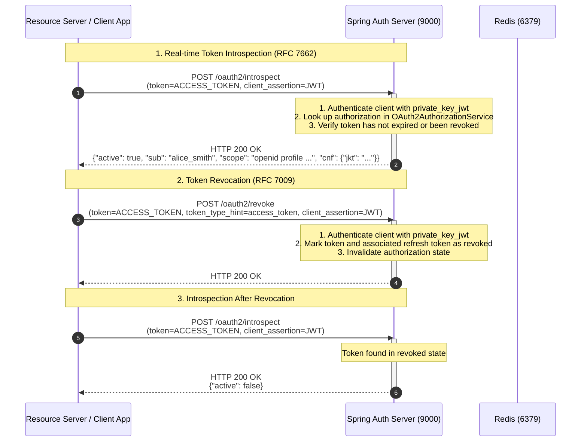
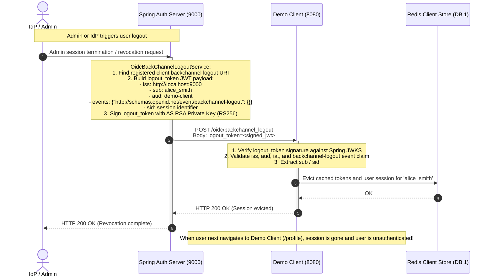

# Token Lifecycle, Revocation & OIDC Back-Channel Logout Flow

This document details the token validation, introspection, revocation, and asynchronous backchannel logout sequences supported by the platform.

---

## 1. RFC 7662 Token Introspection & RFC 7009 Token Revocation

---

## 2. OpenID Connect Back-Channel Logout 1.0

