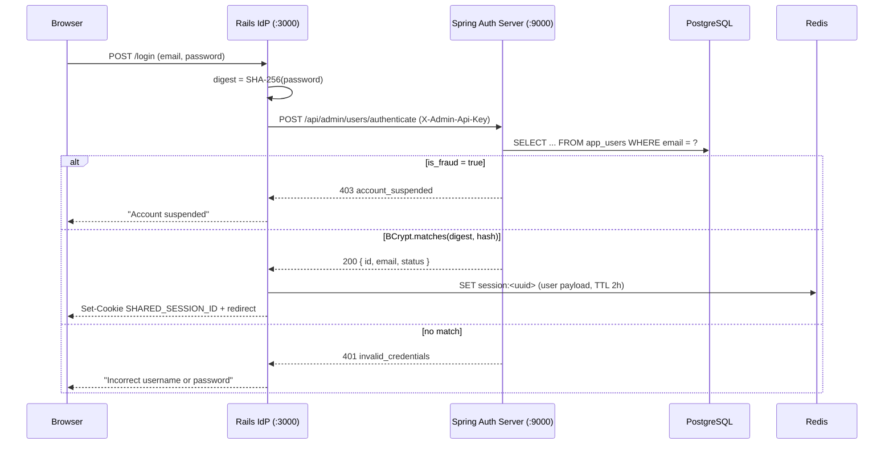

# User Management, Authentication & Fraud Revocation

This document describes the **end-user identity subsystem**: the `app_users` store, the
administrative user-management API, the two-stage password hashing pipeline, the Rails IdP
authentication integration, and the fraud-flag → global session revocation flow.

> **Scope note:** This subsystem manages the *human end-users* who log in through the Rails
> Identity Provider. It is distinct from **registered OAuth clients** (applications), which are
> managed via the [Client Configuration flow](client_config_and_caching_flow.md).

---

## 1. Data Model — `app_users`

Created by Flyway migration [`V4__create_users_table.sql`](../../spring-auth-server/src/main/resources/db/migration/V4__create_users_table.sql):

| Column | Type | Constraints | Purpose |
|---|---|---|---|
| `id` | `UUID` | PK, `DEFAULT gen_random_uuid()` | Stable opaque user identifier. Used as the OIDC `sub` / session principal. |
| `email` | `VARCHAR(255)` | `UNIQUE NOT NULL` | Login identifier. |
| `password_hash` | `VARCHAR(255)` | `NOT NULL` | BCrypt hash of the SHA-256 password digest (see §3). |
| `is_fraud` | `BOOLEAN` | `DEFAULT FALSE` | Fraud flag. When `true`, authentication is refused and active sessions are revoked. |

**Local/dev seed:** the migration seeds one user, `alice_smith@example.com` (password `secret123`),
for local development and functional tests only. Production environments should create real users
via the Admin API and must not rely on the seeded fixture.

Consistent with the platform's data-isolation policy, **only the Spring Authorization Server (Java)
connects to PostgreSQL**. All external management flows go through the authenticated Admin REST API.

---

## 2. Administrative User API

Exposed by [`UserAdminController`](../../spring-auth-server/src/main/java/com/example/authserver/controller/UserAdminController.java)
under `/api/admin/users`. All routes are protected by the same defence-in-depth controls as the client
Admin API: the [`AdminApiKeyFilter`](../../spring-auth-server/src/main/java/com/example/authserver/security/AdminApiKeyFilter.java)
performs constant-time `X-Admin-Api-Key` verification, and the Nginx edge proxy blocks `/api/admin/**`
from the public internet.

| Method | Path | Description | Notable behaviour |
|---|---|---|---|
| `GET` | `/api/admin/users?page={n}&limit={m}` | Paginated user list (`id`, `email`, `is_fraud`). | `page`/`limit` are clamped to sane minimums (`page≥1`, `limit≥1`). Returns `{ users, total, page, totalPages }`. |
| `POST` | `/api/admin/users` | Create a user. Body: `{ email, password }`. | `password` is the SHA-256 digest (see §3); server BCrypts it. Rejects blank email/password with `400`. |
| `PUT` | `/api/admin/users/{email}` | Update email and/or password. | If the email changes, all of the user's sessions/authorizations are revoked (see §5). Password-only change does not revoke. |
| `POST` | `/api/admin/users/{email}/fraud` | Flag the user as fraudulent. | Sets `is_fraud=true` **and** triggers global revocation. `404` if the user does not exist. |
| `POST` | `/api/admin/users/{email}/unfraud` | Clear the fraud flag. | `404` if the user does not exist. Does not restore revoked sessions (the user must re-authenticate). |
| `DELETE` | `/api/admin/users/{email}` | Delete a user. | Revokes sessions first, then deletes. `404` if the user does not exist. |
| `POST` | `/api/admin/users/authenticate` | Verify credentials. Body: `{ email, password }`. | Used by the Rails IdP. Returns `200` `{ id, email, status }` on success; `401 invalid_credentials`; `403 account_suspended` when `is_fraud=true`. |

The Next.js **Client Manager** surfaces a subset of these through the
[Users page](../../client-manager/app/users/page.tsx) (list, create, edit, flag/unflag fraud, pagination),
proxying to the Admin API via [`client-manager/lib/users.ts`](../../client-manager/lib/users.ts).

---

## 3. Two-Stage Password Pipeline (SHA-256 → BCrypt)

Passwords are hashed **twice, at two different tiers**, so the plaintext never crosses a service
boundary and the stored hash is resistant to offline brute-force:

```
Browser plaintext
   │
   ▼  (Rails IdP / Client Manager, client tier)
SHA-256 hex digest ──────────────►  crosses the network (never plaintext)
   │
   ▼  (Spring Authorization Server, server tier)
BCrypt(cost=10) of the SHA-256 digest ──────►  stored in app_users.password_hash
```

- **Client tier** (Rails `SessionsController`, Client Manager `users.ts`): computes
  `SHA-256(plaintext)` and sends only the hex digest. This is a defence-in-depth measure — the
  authorization server never receives the raw password.
- **Server tier** ([`UserAdminController`](../../spring-auth-server/src/main/java/com/example/authserver/controller/UserAdminController.java)):
  applies `BCryptPasswordEncoder(10)` to the incoming digest for both storage (`encode`) and
  verification (`matches`, which is constant-time). BCrypt adds a per-hash salt and adaptive work
  factor, defeating rainbow-table and GPU brute-force attacks that plain SHA-256 is vulnerable to.

> **Why two stages?** SHA-256 alone is a fast, unsalted hash and is unsuitable for password storage.
> BCrypt alone would require the plaintext at the server boundary. Combining them keeps plaintext
> client-side while retaining BCrypt's salted, adaptive protection at rest. The trade-off: BCrypt's
> 72-byte input limit is comfortably satisfied because the input is always a fixed 64-char hex digest.
> See §7 for stronger alternatives (Argon2id).

---

## 4. Rails IdP Authentication Integration

The Rails Identity Provider no longer hardcodes credentials. On login,
[`SessionsController#create`](../../rails-app/app/controllers/sessions_controller.rb):

1. Reads `email` + `password` from the login form.
2. Computes `SHA-256(password)` and `POST`s `{ email, password: <digest> }` to
   `POST {SPRING_AUTH_SERVER_URL}/api/admin/users/authenticate` with the `X-Admin-Api-Key` header.
3. Branches on the response:
   - `200` → builds a session payload keyed by the returned user `id`, invalidates any prior session
     (session-fixation defence), issues a UUIDv4 `SHARED_SESSION_ID`, and writes `session:<uuid>` to Redis.
   - `403` → renders "account temporarily suspended" (fraud flag), or redirects the client callback with
     an `account_suspended` error.
   - `401`/`404` → "incorrect username or password".
   - other → generic `500`.



The `SHARED_SESSION_ID` cookie is then read by the Spring Authorization Server's
[`SharedRedisSessionFilter`](../../spring-auth-server/src/main/java/com/example/authserver/security/SharedRedisSessionFilter.java)
during the `/oauth2/authorize` step (see the [PAR + SSO flow](oauth2_par_dpop_flow.md)).

---

## 5. Fraud Flag → Global Session Revocation

Flagging a user as fraud, changing their email, or deleting them triggers
[`UserSessionRevocationService#revokeUserGlobally`](../../spring-auth-server/src/main/java/com/example/authserver/security/UserSessionRevocationService.java),
which performs a **three-stage, fail-safe revocation**:

1. **Purge authorizations** — `DELETE FROM oauth2_authorization WHERE principal_name = ?` removes all
   issued authorization codes, access/refresh token records, and consents for the user.
2. **Evict SSO sessions** — a non-blocking Redis `SCAN` over `session:*` deletes any session whose JSON
   payload contains the user's `username`. (`SCAN` is used instead of `KEYS` to avoid blocking Redis.)
3. **Evict a specific session** — if a concrete `SHARED_SESSION_ID` is supplied, it is validated as a
   UUID and deleted directly.

The net effect: a flagged user is signed out everywhere, their refresh tokens stop working immediately,
and their next `/authenticate` attempt is rejected with `403 account_suspended`. Unflagging clears the
database flag but does **not** resurrect revoked sessions — the user must log in again.

---

## 6. Security Properties & Notes

- **Plaintext isolation:** raw passwords never leave the client tier.
- **Constant-time verification:** BCrypt `matches` avoids timing side-channels; the admin key check uses
  `MessageDigest.isEqual`.
- **Enumeration resistance:** authentication returns the same `invalid_credentials` for both unknown
  email and wrong password.
- **Fail-closed fraud handling:** the fraud check precedes password verification, so a flagged account
  cannot authenticate even with correct credentials.
- **Zero-trust boundary:** the user API is only reachable via the authenticated Admin API; the edge proxy
  blocks `/api/admin/**` publicly.

Test coverage: [`UserAdminControllerTest`](../../spring-auth-server/src/test/java/com/example/authserver/controller/UserAdminControllerTest.java)
(MockMvc, all endpoints and error paths) and [`UserSessionRevocationServiceTest`](../../spring-auth-server/src/test/java/com/example/authserver/security/UserSessionRevocationServiceTest.java);
the client-manager proxy is covered by [`users.test.ts`](../../client-manager/__tests__/users.test.ts).

---

## 7. Stronger Password-Hashing Options (Not Implemented)

See [Higher Key & Cryptographic Standards](higher_key_and_crypto_standards.md#password-hashing) for a
pros/cons comparison of **Argon2id**, **scrypt**, and **PBKDF2** as alternatives to the current
BCrypt(cost=10) server-tier hash.
