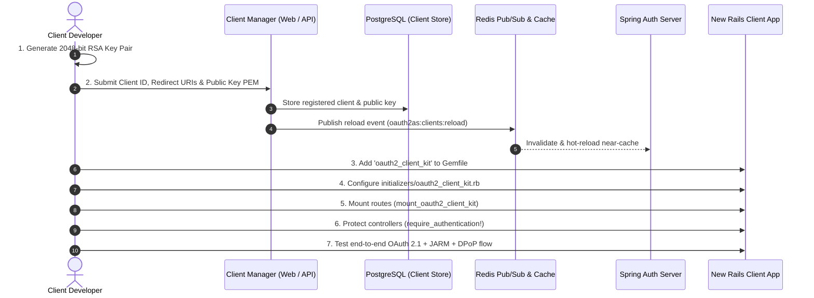

# New Client Onboarding & Integration Guide

This guide provides a comprehensive, step-by-step walkthrough for teams connecting a new client application (such as a Ruby on Rails web app or service) to the centralized **Spring Security OAuth 2.1 & OpenID Connect Authorization Server**.

---

## Architecture Overview & Setup Workflow



---

## Step 1: Generate Client Cryptographic Key Pair

Our OAuth 2.1 platform enforces **RFC 7523 Asymmetric Client Authentication (`private_key_jwt`)**. Shared client secrets (`client_secret_basic` or `client_secret_post`) are strictly prohibited and rejected by the server.

Generate a dedicated 2048-bit RSA key pair in your client project:

```bash
# Create directory for local development keys
mkdir -p config/keys

# 1. Generate RSA 2048-bit Private Key (PKCS#8 or traditional PEM)
openssl genrsa -out config/keys/client_private_key.pem 2048

# 2. Extract RSA Public Key in X.509 PEM format
openssl rsa -in config/keys/client_private_key.pem -pubout -out config/keys/client_public_key.pem

# 3. Restrict permissions on private key
chmod 600 config/keys/client_private_key.pem
```

> [!IMPORTANT]
> **Key Management Best Practices:**
> - Add `config/keys/client_private_key.pem` to your project's `.gitignore`. **Never commit private keys to version control!**
> - In staging/production environments, inject the private key via an environment variable (`CLIENT_PRIVATE_KEY_PEM`), Rails encrypted credentials, or AWS Secrets Manager / HashiCorp Vault.
> - The **Public Key** (`client_public_key.pem`) is public information and will be uploaded to the Authorization Server in Step 2.

---

## Step 2: Register Client in Configuration Manager

Before your application can authenticate users, it must be registered with the Authorization Server. You can register via the **Client Configuration Manager Web UI** or the **Administrative REST API**.

### Option A: Next.js Client Configuration Manager (Web UI)

1. Open the Client Configuration Manager dashboard in your browser:
   - **Local Development:** `http://localhost:3001`
   - **Staging / Production:** `https://client-manager.corp.internal`
2. Click **"Register New Client"** (or "+ New Client").
3. Fill in the client configuration form:

| Field | Description | Example (Local Dev) | Example (Production) |
|---|---|---|---|
| **Client ID** | Unique kebab-case identifier | `accounting-portal` | `accounting-portal` |
| **Client Name** | Human-readable service name | `Accounting & Billing Portal` | `Accounting & Billing Portal` |
| **Redirect URIs** | Whitelisted callback URL(s) | `http://localhost:8080/callback` | `https://accounting.corp.internal/callback` |
| **Post-Logout URIs** | Whitelisted post-logout landing URL(s) | `http://localhost:8080/` | `https://accounting.corp.internal/` |
| **Public Key (PEM)** | Full contents of `client_public_key.pem` | `-----BEGIN PUBLIC KEY-----\nMIIB...` | `-----BEGIN PUBLIC KEY-----\nMIIB...` |
| **Authentication Method** | Client auth scheme | `private_key_jwt` | `private_key_jwt` |
| **Grant Types** | Allowed OAuth 2.1 grant types | `authorization_code`, `refresh_token` | `authorization_code`, `refresh_token` |
| **Authorized Scopes** | Server-determined scopes granted to this client | `openid`, `profile`, `email`, `accounting.read` | `openid`, `profile`, `email`, `accounting.read` |
| **PKCE Required** | RFC 7636 S256 Code Challenge | `true` (Enforced) | `true` (Enforced) |
| **PAR Required** | RFC 9126 Pushed Authorization Requests | `true` (Enforced) | `true` (Enforced) |
| **Access Token TTL** | Lifespan of issued access tokens | `15` minutes | `15` minutes |
| **Refresh Token TTL** | Lifespan of refresh tokens | `30` days | `30` days |

4. Click **"Save Client"**.
   - The client record and public key are transactionally persisted into PostgreSQL (`oauth2_registered_client` and `oauth2_client_public_key`).
   - The Client Manager broadcasts a message across Redis Pub/Sub (`oauth2as:clients:reload`).
   - The Spring Authorization Server cluster immediately hot-reloads its in-memory L1 cache. **No server restart is required.**

---

### Option B: Automated Registration via Admin REST API (`curl` / CI/CD)

For automated Terraform, Ansible, or CI/CD pipelines, provision clients directly via the Admin API:

```bash
# Read and escape the public key
PUB_KEY=$(awk 'NF {sub(/\r/, ""); printf "%s\\n",$0}' config/keys/client_public_key.pem)

curl -X POST http://localhost:9000/api/admin/clients \
  -H "Content-Type: application/json" \
  -H "X-Admin-Api-Key: secret-admin-key" \
  -d '{
    "clientId": "accounting-portal",
    "clientName": "Accounting & Billing Portal",
    "clientAuthenticationMethods": ["private_key_jwt"],
    "authorizationGrantTypes": ["authorization_code", "refresh_token"],
    "redirectUris": ["http://localhost:8080/callback"],
    "postLogoutRedirectUris": ["http://localhost:8080/"],
    "scopes": ["openid", "profile", "email", "accounting.read"],
    "requireProofKey": true,
    "requireAuthorizationConsent": false,
    "requirePushedAuthorizationRequests": true,
    "accessTokenTimeToLiveMinutes": 15,
    "refreshTokenTimeToLiveDays": 30,
    "publicKeyPem": "'"${PUB_KEY}"'"
  }'
```

---

## Step 3: Add `oauth2_client_kit` to Your Rails App

Add the client authentication engine to your Rails application `Gemfile`:

```ruby
# Gemfile
source 'https://rubygems.org'

gem 'rails', '~> 8.0'

# OAuth 2.1 & OpenID Connect Client Kit
# In a local development monorepo:
gem 'oauth2_client_kit', path: '../oauth2_client_kit'

# Or from private Git repository / Gemfury in production:
# gem 'oauth2_client_kit', git: 'git@github.com:your-org/oauth2_client_kit.git', branch: 'main'
```

Install dependencies:
```bash
bundle install
```

---

## Step 4: Configure the Client Initializer

Create an initializer at `config/initializers/oauth2_client_kit.rb`:

```ruby
# frozen_string_literal: true

require "oauth2_client_kit"

OAuth2ClientKit.configure do |config|
  # 1. Registered Client Identifier
  config.client_id = ENV.fetch("CLIENT_ID", "accounting-portal")

  # 2. Private Key for private_key_jwt (file path or inline PEM string)
  if ENV["CLIENT_PRIVATE_KEY_PEM"].present?
    config.private_key_pem = ENV["CLIENT_PRIVATE_KEY_PEM"]
  else
    config.private_key_path = ENV.fetch(
      "CLIENT_PRIVATE_KEY_PATH",
      Rails.root.join("config/keys/client_private_key.pem").to_s
    )
  end

  # 3. Canonical Public Issuer URL (Browser-facing redirect domain)
  config.issuer_url = ENV.fetch("AUTH_SERVER_URL", "http://localhost:9000")

  # 4. Internal Issuer URL (Direct container-to-container / service mesh URL for backchannel PAR, Token, and JWKS requests)
  config.internal_issuer_url = ENV.fetch("AUTH_SERVER_URL_INTERNAL", config.issuer_url)

  # 5. Redis URL for token caching, DPoP key management, and Back-Channel Logout eviction
  config.redis_url = ENV.fetch("REDIS_URL", "redis://localhost:6379/1")

  # 6. Admin API Key (used for Back-Channel Logout registration and administrative tasks)
  config.admin_api_key = ENV.fetch("ADMIN_API_KEY", "secret-admin-key")

  # 7. Post-authentication landing paths
  config.after_login_path = "/dashboard"
  config.after_logout_path = "/"
end
```

### Environment Variables Reference

| Variable | Description | Default / Example |
|---|---|---|
| `CLIENT_ID` | Registered OAuth 2.1 Client ID | `accounting-portal` |
| `CLIENT_PRIVATE_KEY_PATH` | Path to RSA private key file | `config/keys/client_private_key.pem` |
| `CLIENT_PRIVATE_KEY_PEM` | Inline RSA private key PEM (Production) | *(Optional)* |
| `AUTH_SERVER_URL` | Public browser URL of Authorization Server | `http://localhost:9000` |
| `AUTH_SERVER_URL_INTERNAL`| Internal network URL for backend HTTP calls | `http://localhost:9000` (or `http://auth-server:9001`) |
| `REDIS_URL` | Redis instance for client token sessions | `redis://localhost:6379/1` |
| `ADMIN_API_KEY` | Shared admin key for system sync | `secret-admin-key` |

---

## Step 5: Mount Authentication Routes

In your Rails application `config/routes.rb`, call the `mount_oauth2_client_kit` route macro:

```ruby
Rails.application.routes.draw do
  root to: "home#index"
  get "/dashboard", to: "dashboard#show"

  # Mounts all built-in OAuth 2.1 & OpenID Connect endpoints:
  # - GET  /auth/start               -> Initiates RFC 9126 PAR and redirects to Auth Server
  # - GET  /callback                 -> Validates RFC 9221 JARM token, exchanges code via DPoP
  # - POST /auth/refresh             -> Performs token refresh with DPoP rotation
  # - POST /logout                   -> Performs RP-Initiated Logout 1.0
  # - POST /oidc/backchannel_logout  -> Receives signed logout_token from Auth Server
  mount_oauth2_client_kit
end
```

---

## Step 6: Controller & View Integration

### 1. Protecting Controllers
Include `OAuth2ClientKit::ControllerMethods` in your `ApplicationController` (or specific resource controllers) to enable authentication filters and session helpers:

```ruby
# app/controllers/application_controller.rb
class ApplicationController < ActionController::Base
  protect_from_forgery with: :exception
  include OAuth2ClientKit::ControllerMethods
end
```

In your protected controllers:

```ruby
# app/controllers/dashboard_controller.rb
class DashboardController < ApplicationController
  # Require a valid, authenticated OAuth 2.1 session
  before_action :require_authentication!

  def show
    # Automatically refreshes the access token if expiring within 60 seconds
    ensure_fresh_access_token!

    # Helper methods provided by oauth2_client_kit:
    @user           = current_user                # Combined UserInfo + ID Token profile
    @access_token   = current_access_token        # Active DPoP-bound raw access token
    @scopes         = current_token_scopes        # Server-determined authorized scopes
    @id_token_claims= current_id_token_claims     # Raw claims from verified ID Token
  end
end
```

### 2. Pre-Flight Identity Checkpoint (Sensitive Business Actions)
For high-risk actions (such as initiating payments, exporting data, or modifying account credentials), enforce a real-time pre-flight **RFC 7662 Token Introspection Checkpoint**:

```ruby
# app/controllers/payments_controller.rb
class PaymentsController < ApplicationController
  before_action :require_authentication!

  def create
    # Identity Checkpoint:
    # Executes an immediate RFC 7662 Token Introspection call against the Spring Auth Server.
    # If the user session was revoked at the IdP (fraud alert / global logout),
    # this immediately terminates the local session and halts execution.
    checkpoint = identity_checkpoint!

    unless checkpoint[:active]
      flash[:error] = "Security Checkpoint Failed: Session has expired or was revoked."
      return redirect_to root_path
    end

    # Proceed safely with business logic
    PaymentService.process!(current_user, params[:amount])
    redirect_to dashboard_path, notice: "Payment processed successfully!"
  end
end
```

### 3. Adding Login and Logout to Views

In your ERB templates:

```erb
<% if authenticated? %>
  <p>Signed in as <strong><%= current_user["email"] || current_user["sub"] %></strong></p>
  <%= link_to "Dashboard", "/dashboard", class: "btn" %>
  
  <!-- Single Sign-Out via RP-Initiated Logout -->
  <%= button_to "Sign Out", "/logout", method: :post, class: "btn-danger" %>
<% else %>
  <!-- Initiates Pushed Authorization Request (PAR) & redirect to IdP -->
  <%= link_to "Sign In with SSO", "/auth/start", class: "btn-primary" %>
<% end %>
```

---

## Step 7: Local Verification & Integration Checklist

Once setup is complete, verify your integration against the following 6-point checklist:

- [ ] **1. Pushed Authorization Requests (PAR):** Navigating to `/auth/start` performs a backchannel POST to `/oauth2/par` using `private_key_jwt` and receives a single-use `request_uri`.
- [ ] **2. Single Sign-On Redirect:** The user is redirected to the Rails Login IdP (`http://localhost:3000/login`) with `request_uri`.
- [ ] **3. RFC 9221 JARM Authorization Response:** After authentication, the browser redirects back to `/callback?response=<jwt>`. The client library verifies the RS256 signature using the published `/oauth2/jwks`.
- [ ] **4. Sender-Constrained DPoP Token:** Code exchange at `/oauth2/token` uses ephemeral EC P-256 keys and server nonces. The issued access token has `token_type: "DPoP"` and contains a `cnf.jkt` claim.
- [ ] **5. Server-Determined Scopes:** Access token claims contain exactly the scopes registered in the Client Manager, regardless of what query parameters were sent.
- [ ] **6. RP-Initiated & Backchannel Logout:**
  - Clicking "Sign Out" redirects to `/connect/logout?id_token_hint=...`, clearing the Authorization Server and IdP sessions.
  - Revoking the session via Client Manager triggers an asynchronous Back-Channel Logout (`POST /oidc/backchannel_logout`), clearing local Redis token caches.

---

## Common Pitfalls & Troubleshooting

### 1. `invalid_client` during `/oauth2/par` or `/oauth2/token`
- **Cause:** Public key mismatch, or Client ID is not registered in PostgreSQL.
- **Fix:** Check that `client_id` in `oauth2_client_kit.rb` matches the exact string registered in the Client Manager. Ensure the public key uploaded matches `client_private_key.pem`.

### 2. `invalid_request_uri` or PAR Rejection
- **Cause:** `redirect_uri` sent during PAR does not match the exact registered URI in PostgreSQL.
- **Fix:** Ensure the callback URI matches character-for-character, including protocol, port, and trailing slashes (e.g. `http://localhost:8080/callback`).

### 3. DPoP Nonce Loop (`use_dpop_nonce`)
- **Behavior:** The Auth Server responds with HTTP 400 and `DPoP-Nonce: <nonce>`.
- **Note:** This is standard RFC 9449 behavior. `oauth2_client_kit` automatically catches this response, caches the fresh server nonce, and retries the request transparently.

### 4. OpenSSL Private Key Read Error
- **Cause:** Permission issues or invalid PEM encoding.
- **Fix:** Verify file exists and permissions are readable by the Rails process (`chmod 600 config/keys/client_private_key.pem`).
