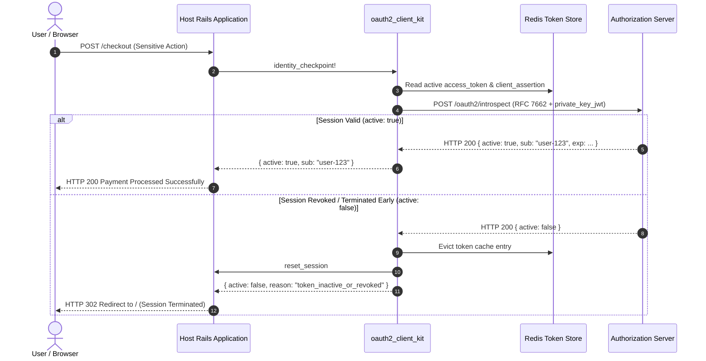

# OAuth 2.1 & OpenID Connect Client Kit (`oauth2_client_kit`)

A high-assurance, production-grade Ruby library and mountable Rails Engine for OAuth 2.1 and OpenID Connect (OIDC). Provides zero-configuration client security protocols including RFC 9126 (PAR), RFC 7523 (Asymmetric `private_key_jwt`), RFC 9449 (DPoP sender-constrained tokens with server nonces), RFC 7636 (PKCE S256), and pre-flight identity introspection checkpoints.

---

## Features & Standards Compliance

- **RFC 9126 Pushed Authorization Requests (PAR):** Backchannel parameter submission keeping parameters out of browser logs.
- **RFC 7523 Asymmetric Client Authentication:** RS256 `private_key_jwt` assertions eliminating static client secrets.
- **RFC 9449 DPoP Sender-Constrained Tokens:** Cryptographically binds access tokens to client keys with automated RFC 9449 §8 server nonce retry loops.
- **RFC 7636 PKCE:** High-entropy code verifiers with SHA-256 challenges.
- **RFC 9207 Issuer Identification:** Protects against Mix-Up attacks.
- **OIDC Core 1.0:** Strict RS256 algorithm pinning, in-memory multi-key JWKS caching with rate-limited rotation, `at_hash`, and `c_hash` verification.
- **OIDC Logout:** Single Sign-Out via RP-Initiated Logout 1.0 and Back-Channel Logout 1.0.
- **Identity Checkpoint (`identity_checkpoint!`):** Pre-flight RFC 7662 token introspection for sensitive actions (e.g. payments) with immediate session revocation handling.

---

## Installation

Add to your application's `Gemfile`:

```ruby
gem "oauth2_client_kit", path: "../oauth2_client_kit"
```

Then execute:
```bash
bundle install
```

---

## Rails Integration

### 1. Configure the Client
Create `config/initializers/oauth2_client_kit.rb`:

```ruby
OAuth2ClientKit.configure do |config|
  config.client_id = "my-client"
  config.private_key_path = Rails.root.join("keys/client_private_key.pem").to_s
  config.issuer_url = ENV.fetch("AUTH_SERVER_URL", "http://localhost:9000")
  config.internal_issuer_url = ENV.fetch("AUTH_SERVER_URL_INTERNAL", config.issuer_url)
  config.redis_url = ENV.fetch("REDIS_URL", "redis://localhost:6379/1")
  config.after_login_path = "/profile"
  config.after_logout_path = "/"
end
```

### 2. Mount Authentication Routes
In `config/routes.rb`:

```ruby
Rails.application.routes.draw do
  root to: "pages#index"
  get "/profile", to: "pages#profile"

  # Mounts /auth/start, /callback, /auth/refresh, /auth/revoke, /logout, /oidc/backchannel_logout
  mount_oauth2_client_kit
end
```

### 3. Controller Methods & Identity Checkpoint
Include `OAuth2ClientKit::ControllerMethods` in your controller:

```ruby
class PaymentsController < ApplicationController
  include OAuth2ClientKit::ControllerMethods

  before_action :require_authentication!

  def create
    # Pre-flight Identity Checkpoint before processing payment:
    # Verifies active status via RFC 7662 Token Introspection to ensure the session hasn't been terminated early.
    # If revoked at Authorization Server, automatically terminates session and halts action.
    checkpoint = identity_checkpoint!

    unless checkpoint[:active]
      flash[:error] = "Security Checkpoint Failed: Session invalid or revoked."
      return redirect_to root_path
    end

    # Proceed with payment...
    flash[:notice] = "Payment approved for user #{checkpoint[:sub]}!"
    redirect_to root_path
  end
end
```

### Available Helper Methods
- `current_user`: Merged profile claims (ID token + UserInfo)
- `authenticated?`: Boolean indicating active user session
- `require_authentication!`: Guard redirecting unauthenticated users to root
- `current_access_token`: Active raw access token
- `current_token_data`: Complete cached token attributes
- `ensure_fresh_access_token!`: Refreshes access token if expiring within 60s
- `identity_checkpoint!`: Pre-flight introspection check to verify if session is still active (aliases: `validate_user!`, `verify_active_token_for_sensitive_action!`)
- `refresh_token_session!`: Explicitly trigger token refresh

---

## Architecture & Integration Model

### Component Separation & Storage Boundaries

```
 ┌─────────────────────────────────────────────────────────────┐
 │                Host Application (e.g. Rails)                │
 │  • Business Domain Controllers, Models, and Views           │
 │  • Client Application Session (Cookies, Redis DB, or DB)    │
 │    (e.g., shopping cart, user preferences, tenant ID)       │
 └──────────────────────────────┬──────────────────────────────┘
                                │ includes ControllerMethods
                                ▼
 ┌─────────────────────────────────────────────────────────────┐
 │                   oauth2_client_kit Gem                     │
 │  • Engine / Route Dispatcher (`mount_oauth2_client_kit`)     │
 │  • Asymmetric Client Assertion (`private_key_jwt`, RS256)   │
 │  • Sender-Constrained DPoP Engine (EC P-256 / ES256)        │
 │  • Strict Algorithm Pinning & JWKS Cache                    │
 │  • Backchannel Logout Receiver (`/oidc/backchannel_logout`)  │
 └──────────────┬──────────────────────────────┬───────────────┘
                │ Reads / Writes Token Data    │ Backchannel TLS
                ▼                              ▼
 ┌──────────────────────────────┐ ┌────────────────────────────┐
 │  Isolated Token Store (DB 1) │ │ Spring Authorization Server │
 │  • Raw tokens & DPoP keys    │ │ (http://localhost:9000)    │
 │  • Single-use OAuth states   │ └────────────────────────────┘
 │  • Sub/SID lookup indexes    │
 └──────────────────────────────┘
```

### Application Sessions vs. Token Store Isolation

Clients often maintain their own user state (cart items, active tabs, tenant context, etc.). To avoid polluting client data or creating storage conflicts:

1. **Client Application Session**: Managed entirely by the host app via standard `session[...]`. The gem only sets minimal reference pointers (`session[:user]`, `session[:token_key]`, `session[:id_token_claims]`).
2. **Token Store**: Managed separately by `OAuth2ClientKit::TokenStore` in a dedicated cache namespace or Redis database (e.g. `redis://localhost:6379/1`). This isolates high-entropy cryptographic keys and raw tokens, and permits asynchronous Back-Channel Logout (BCL) to purge user tokens across Redis without corrupting unrelated application data.

---

## Identity Checkpoint Sequence (`identity_checkpoint!`)

Before executing high-value or sensitive operations (payments, administrative changes, data export), applications can call `identity_checkpoint!` to ensure that the user's authorization session has not been revoked out-of-band by security administrators or fraud-detection engines:



---

## Error Handling & View Overrides

During authentication journeys, if an issue occurs (such as an account lock, consent cancellation, suspended user, or invalid request), errors are returned to the client callback (`/callback?error=...&error_description=...`) adhering to RFC 6749 Section 4.1.2.1.

The library automatically intercepts callback errors and renders clean, accessible error screens with appropriate HTTP statuses (`403 Forbidden` for `access_denied` / `unauthorized_client`, `401 Unauthorized` for authentication requirements, and `400 Bad Request` for request errors).

### View Override Resolution

Consuming applications can customize error views using standard Rails template overrides:

1. **Per-Error Custom Template**: `app/views/oauth2_client_kit/auth/<error_code>.html.erb`  
   *Example:* Creating `app/views/oauth2_client_kit/auth/access_denied.html.erb` in your host application will automatically handle all `access_denied` errors (e.g. account locked or user cancelled) with custom branding, helpdesk links, or retry workflows.
2. **Global Error Override**: `app/views/oauth2_client_kit/auth/error.html.erb`  
   Creating this in your host application overrides the fallback template for all error codes.
3. **Built-in Gem Default**: `oauth2_client_kit/app/views/oauth2_client_kit/auth/error.html.erb`  
   If no custom templates are provided by the host app, the gem renders its built-in error card inside the host application's layout showing `@error`, `@error_description`, and action buttons to retry or return home.

Available instance variables in error views:
- `@error`: The OAuth 2.1 error code (e.g. `access_denied`, `account_suspended`, `invalid_request`).
- `@error_description`: Detailed explanation from the identity provider.
- `@error_uri`: (Optional) Diagnostic documentation link from the identity provider.

